---
## Front matter
lang: ru-RU
title: Лабораторная работа №1
subtitle: Операционные системы
author:
  - Намруев М. С.
institute:
  - Российский университет дружбы народов, Москва, Россия
date: 02 марта 2024

## i18n babel
babel-lang: russian
babel-otherlangs: english

## Fonts
mainfont: PT Sans
romanfont: PT Sans
sansfont: PT Sans
monofont: PT Sans
mainfontoptions: Ligatures=TeX
romanfontoptions: Ligatures=TeX
sansfontoptions: Ligatures=TeX,Scale=MatchLowercase
monofontoptions: Scale=MatchLowercase,Scale=0.9

## Formatting pdf
toc: false
toc-title: Содержание
slide_level: 2
aspectratio: 169
section-titles: true
theme: metropolis
header-includes:
 - \metroset{progressbar=frametitle,sectionpage=progressbar,numbering=fraction}
 - '\makeatletter'
 - '\beamer@ignorenonframefalse'
 - '\makeatother'
---

## Докладчик

:::::::::::::: {.columns align=center}
::: {.column width="70%"}

  * Намруев Максим Саналович
  * студент, 1 курс, НКАбд-04-23
  * Российский университет дружбы народов
  * [1132236035@rudn.ru](mailto:1132236035@rudn.ru)
  * <https://github.com/msnamruev>

:::
::: {.column width="30%"}

:::
::::::::::::::

## Цель работы

Целью данной работы является приобретение практических навыков установки операционной системы на виртуальную машину, настройки минимально необходимых для дальнейшей работы сервисов

## Выполнение лабораторной работы

Запускаю виртуальную машину, нажимаю на кнопку "Создать", ввожу имя виртуальной машины и ввожу образ ISO

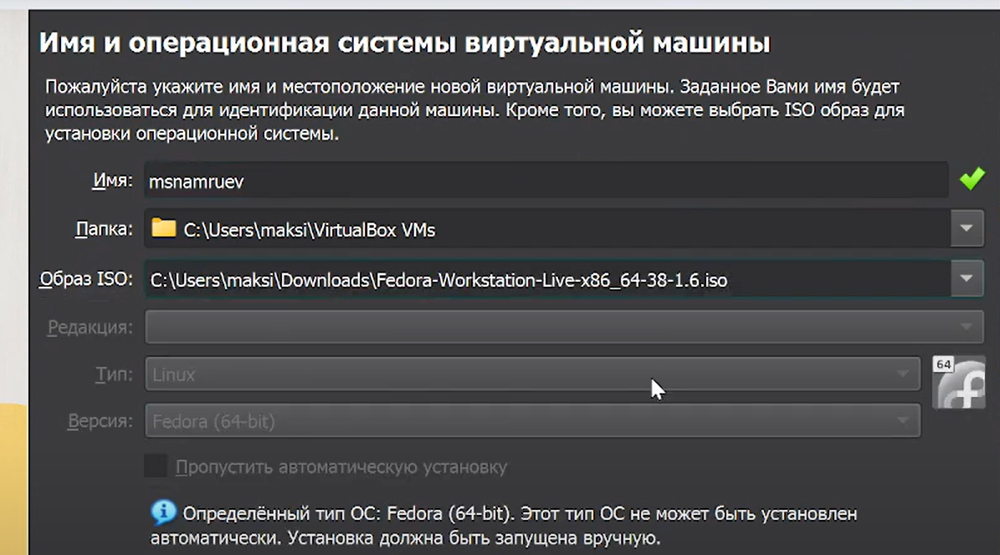

## Выполнение лабораторной работы

Настраиваю виртуальную машину выделяя 8096 Мб основной памяти, 8 ядер процессора и 90 Гб жесткого диска.

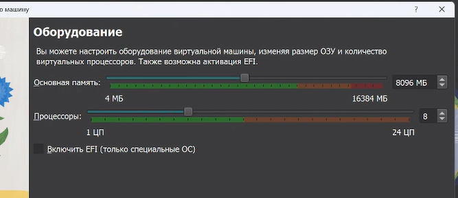

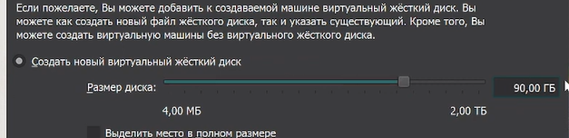

## Выполнение лабораторной работы

После её запуска мне предлагается установаить ОС на жесткий диск, что я и делаю.

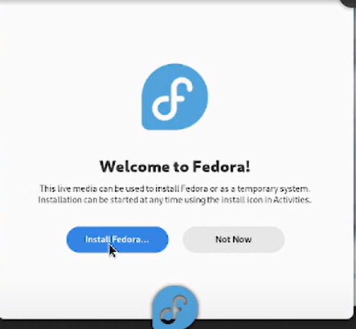

## Выполнение лабораторной работы

При установке ОС выбираю русский язык.

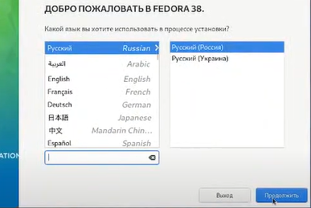

## Выполнение лабораторной работы

Выбираю устройтво по умолчанию и нажимаю "Готово".

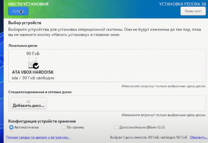

## Выполнение лабораторной работы

Дожидаюсь завершения загрузки.

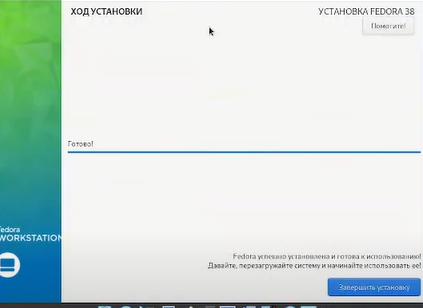

## Выполнение лабораторной работы

Далее выключаю виртуальную машину, изымаю диск и привода и запускаю её снова. 

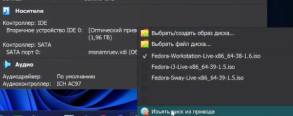

## Выполнение лабораторной работы

Далле завершаю настройку ОС, вводя её имя (msnamruev).

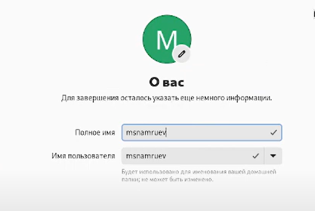

## Выполнение лабораторной работы

Далле вхожу в ОС под заданной мной при установке учетной записью, переключаюсь на роль супер-пользователя, и обновляю все пакеты.

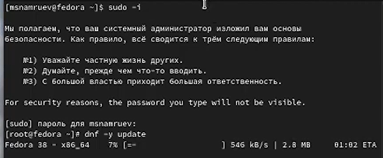

## Выполнение лабораторной работы

Далее устанавливаю программы для удобства работы в консоли.

## Выполнение лабораторной работы

Использую автоматическое обновление.

## Выполнение лабораторной работы

Запускаю таймер.

## Выполнение лабораторной работы

В файле /etc/selinux/config заменяю значение SELINUX=enforcing на SELINUX=permissive и перезапускаю виртуальную машину.

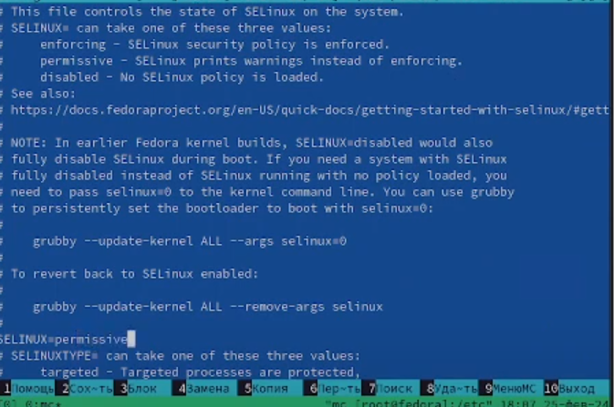

## Выполнение лабораторной работы

Устанавливаю средства разработки.

## Выполнение лабораторной работы

Устанавливаю пакеты DKMS.

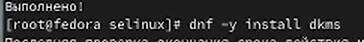

## Выполнение лабораторной работы

Подключаю образ диска Дополнений гостевой ОС.

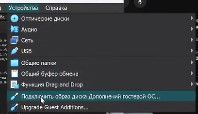

## Выполнение лабораторной работы

Подмонтирую диск, устанавливаю драйвера и перезагружаю Виртуальную машину. 

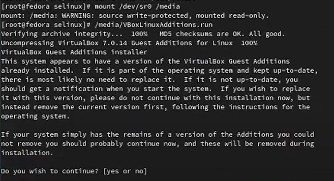

## Выполнение лабораторной работы

Меняю имя хоста на msnamruev.

## Выполнение лабораторной работы

Устаналиваю средство pandoc для работы с Markdown.

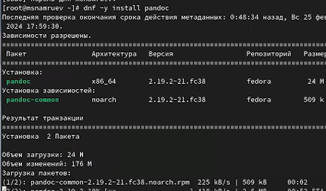

## Выполнение лабораторной работы

Устанавливаю дистрибутив TeXlive.

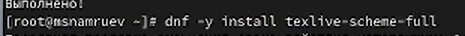

## Выводы

После выполнения данной лабораторной работы я приобрел навыки установки операционной системы на виртуальную машину, настройки минимально необходимых для дальнейшей рыботы сервисов.

