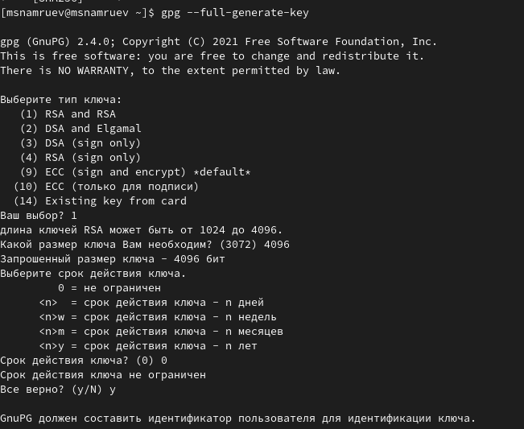
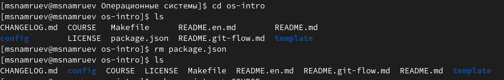
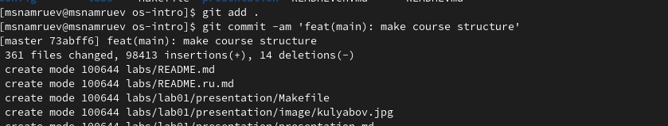

---
## Front matter
lang: ru-RU
title: Лабораторная работа №2
subtitle: Операционные системы
author:
  - Намруев М. С.
institute:
  - Российский университет дружбы народов, Москва, Россия
date: 02 марта 2024

## Fonts
mainfont: PT Sans
romanfont: PT Sans
sansfont: PT Sans
monofont: PT Sans
mainfontoptions: Ligatures=TeX
romanfontoptions: Ligatures=TeX
sansfontoptions: Ligatures=TeX,Scale=MatchLowercase
monofontoptions: Scale=MatchLowercase,Scale=0.9

## i18n babel
babel-lang: russian
babel-otherlangs: english

## Formatting pdf
toc: false
toc-title: Содержание
slide_level: 2
aspectratio: 169
section-titles: true
theme: metropolis
header-includes:
 - \metroset{progressbar=frametitle,sectionpage=progressbar,numbering=fraction}
 - '\makeatletter'
 - '\beamer@ignorenonframefalse'
 - '\makeatother'
---

## Докладчик

:::::::::::::: {.columns align=center}
::: {.column width="70%"}

  * Намруев Максим Саналович
  * студент, 1 курс, НКАбд-04-23
  * Российский университет дружбы народов
  * [1122236035@rudn.ru](mailto:1122236035@rudn.ru)
  * <https://github.com/msnamruev>

:::
::: {.column width="30%"}

:::
::::::::::::::

## Цель работы

1. Изучить идеологию и применение средств контроля версий.

2. Освоить умения по работе с git.

## Выполнение лабораторной работы

Открываю терминал и устанавливаю git 

## Выполнение лабораторной работы

Далее устанавливаю gh.

## Выполнение лабораторной работы

Задаю имя и email владельца репозитория, а также настраиваю utf-8 в выводе сообщений git, задаю имя начальной ветки, настраиваю параметр autocrlf и safecrlf.

## Выполнение лабораторной работы

Создаю ssh ключ по алгоритму rsa с размером 4096 бит.

## Выполнение лабораторной работы

Создаю ssh ключ по алгоритму ed25519.

## Выполнение лабораторной работы

Генерирую pgp ключ.В предложенных опциях выбираю: тип RSA and RSA, размер 4096 и срок действия по умолчанию.

## Выполнение лабораторной работы

Далее ввожу личную информацию (Имя, адрес электронной почты).

## Выполнение лабораторной работы

Создаю учетную запись на github и заполняю основные данные.

## Выполнение лабораторной работы

Вывожу список ключей.

## Выполнение лабораторной работы

Копирую мой сгенерированный PGP ключ в буфер обмена.

## Выполнение лабораторной работы

Перехожу в настройки GitHub, нажимаю на кнопку New GPG key и вставляю полученный ключ в полу ввода.

## Выполнение лабораторной работы

Используя введёный email, указываю Git применять его при подписи коммитов.

## Выполнение лабораторной работы

Авторизуюсь в gh.

## Выполнение лабораторной работы

Создаю шаблон рабочего пространства. Для этого создаю нужные каталоги.

## Выполнение лабораторной работы

Создаю репозиторий на GitHub.

## Выполнение лабораторной работы

Далее клонирую репозиторий.

## Выполнение лабораторной работы

Перехожу в каталог курса и удаляю лишние файлы.

## Выполнение лабораторной работы

Создаю необходимые каталоги.

## Выполнение лабораторной работы

Отправляю файлы на сервер.

## Выводы

После выполнение данной лабораторной работы я изучил идеологию и применение средств контроля версий и освоил умения по работе с git

