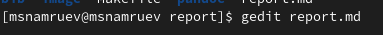
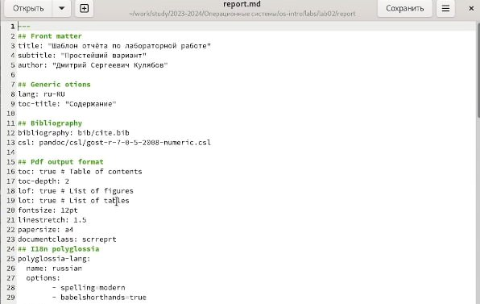
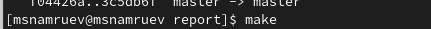
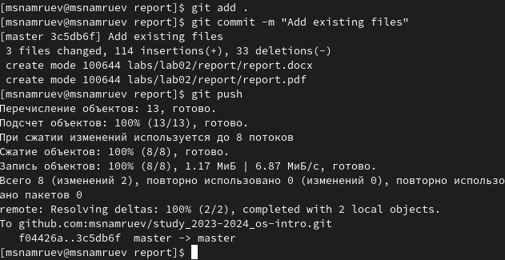

---
## Front matter
lang: ru-RU
title: Лабораторная работа №3
subtitle: Операционные системы
author:
  - Намруев М. С.
institute:
  - Российский университет дружбы народов, Москва, Россия
date: 02 марта 2024

## i18n babel
babel-lang: russian
babel-otherlangs: english

## Fonts
mainfont: PT Sans
romanfont: PT Sans
sansfont: PT Sans
monofont: PT Sans
mainfontoptions: Ligatures=TeX
romanfontoptions: Ligatures=TeX
sansfontoptions: Ligatures=TeX,Scale=MatchLowercase
monofontoptions: Scale=MatchLowercase,Scale=0.9

## Formatting pdf
toc: false
toc-title: Содержание
slide_level: 2
aspectratio: 169
section-titles: true
theme: metropolis
header-includes:
 - \metroset{progressbar=frametitle,sectionpage=progressbar,numbering=fraction}
 - '\makeatletter'
 - '\beamer@ignorenonframefalse'
 - '\makeatother'
---

## Докладчик

:::::::::::::: {.columns align=center}
::: {.column width="70%"}

  * Намруев Максим Саналович
  * Студент, 1 курс, НКАбд-04-23
  * Российский университет дружбы народов
  * [1132236035@rudn.ru](mailto:1132236035@rudn.ru)
  * <https://github.com/msnamruev>

:::
::: {.column width="30%"}

:::
::::::::::::::
## Цель работы

Научиться оформлять отчёты с помощью легковесного языка разметки Markdown.

## Выполнение лабораторной работы

Перехожу в папку с лабораторной работой №2 и открываю файл report.md через утилиту gedit.

## Выполнение лабораторной работы

После открытия начинаю заполнение отчета.

## Выполнение лабораторной работы

После завершения написания отчета, сохраняю файл и конвертирую его в форматы pdf и docx.

## Выполнение лабораторной работы

Далее отправляю файлы на GitHub.

## Выводы

После завершения данной лабораторной работы я научился работать с легковесным языком разметки Markdown.

