---
## Front matter
lang: ru-RU
title: Лабораторная работа №4
subtitle: Операционные системы
author:
  - Намруев М. С.
institute:
  - Российский университет дружбы народов, Москва, Россия
date: 09 марта 2024

## i18n babel
babel-lang: russian
babel-otherlangs: english

## Fonts
mainfont: PT Sans
romanfont: PT Sans
sansfont: PT Sans
monofont: PT Sans
mainfontoptions: Ligatures=TeX
romanfontoptions: Ligatures=TeX
sansfontoptions: Ligatures=TeX,Scale=MatchLowercase
monofontoptions: Scale=MatchLowercase,Scale=0.9

## Formatting pdf
toc: false
toc-title: Содержание
slide_level: 2
aspectratio: 169
section-titles: true
theme: metropolis
header-includes:
 - \metroset{progressbar=frametitle,sectionpage=progressbar,numbering=fraction}
 - '\makeatletter'
 - '\beamer@ignorenonframefalse'
 - '\makeatother'
---

## Докладчик

:::::::::::::: {.columns align=center}
::: {.column width="70%"}

  * Намруев Максим Саналович
  * Студент, 1 курс, НКАбд-04-23
  * Российский университет дружбы народов
  * [1132236035@rudn.ru](mailto:1132236035@rudn.ru)
  * <https://github.com/msnamruev>

:::
::: {.column width="30%"}

:::
::::::::::::::

## Цель работы

Получение навыков правильной работы с репозиториями git.

## Задание

1. Выполнить работу для тестового репозитория.

2. Преобразовать рабочий репозиторий в репозиторий с git-flow и conventional commits.

## Выполнение лабораторной работы

Устанавливаю git-flow из коллекции репозиториев Copr 

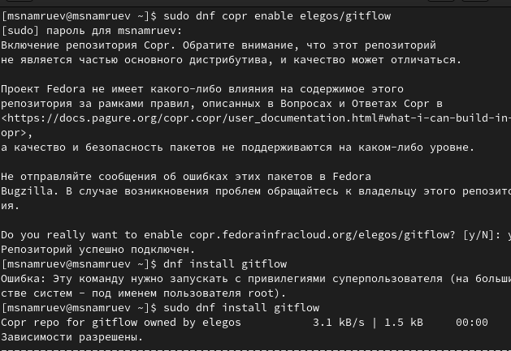

## Выполнение лабораторной работы

Устанавливаю Node.js 

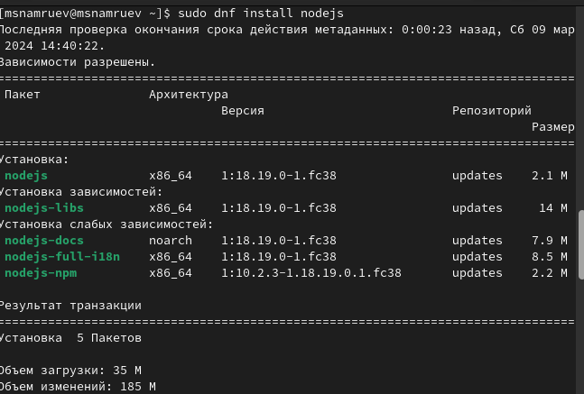

## Выполнение лабораторной работы

Запускаю pnpm.

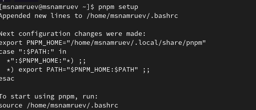

## Выполнение лабораторной работы

Перелогиниваюсь и выполняю sourse ~/.bashrc 

## Выполнение лабораторной работы

Выполненяю коммит commitizen.

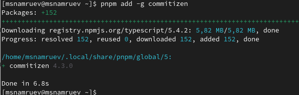

## Выполнение лабораторной работы

Выполняю коммит standart-changelog 

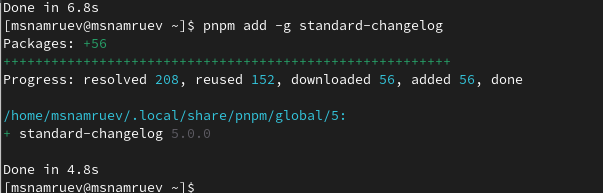

## Выполнение лабораторной работы

Создаю новый репозиторий git-extended.

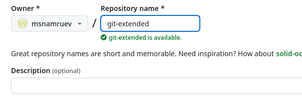

## Выполнение лабораторной работы

Перехожу в папку work и клонирую его.

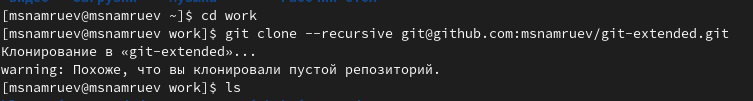

## Выполнение лабораторной работы

Перехожу в него и делаю первый коммит.

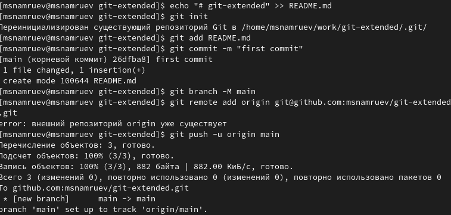

## Выполнение лабораторной работы

Далее выполняю конфигурацию для пакетов node.js.

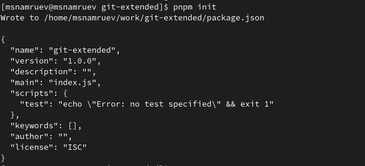

## Выполнение лабораторной работы

Далее запоняю несколько параметров пакета.

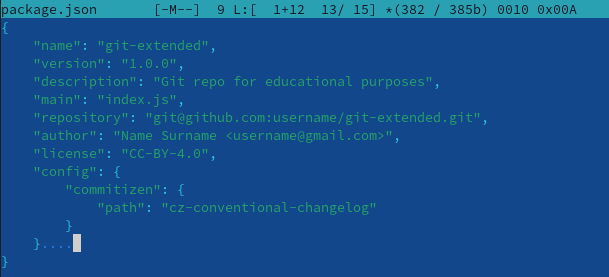

## Выполнение лабораторной работы

Добавляю новые файлы и выпоняю коммит.

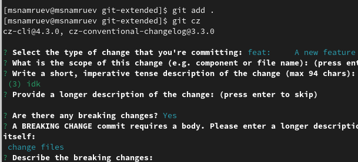

## Выполнение лабораторной работы

Далее отправляю файлы на github.

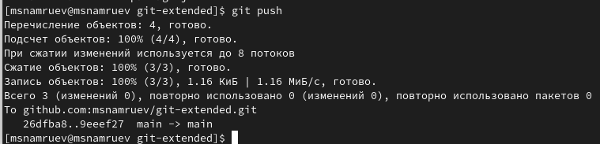

## Выполнение лабораторной работы

Инициализируем git-flow.

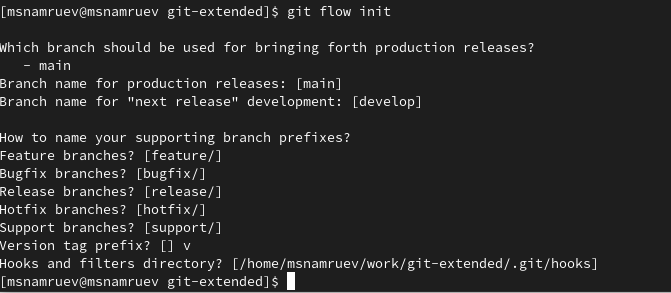

## Выполнение лабораторной работы

Проверяю, что нахожусь в ветке develop.

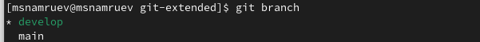

## Выполнение лабораторной работы

Загружаю весь репозиторий в хранилище.

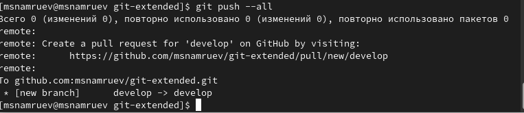

## Выполнение лабораторной работы

Устанавливаю внешнюю ветку как вышестоящую для этой ветки.

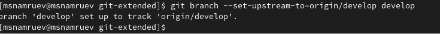

## Выполнение лабораторной работы

Создаю релиз с версией 1.0.0 

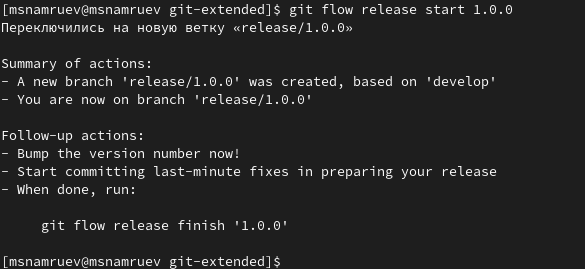

## Выполнение лабораторной работы

Создаю журнал изменений.

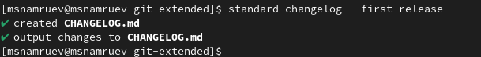

## Выполнение лабораторной работы

Добавляю в журнал изменений индекс.

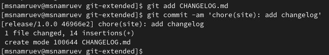

## Выполнение лабораторной работы

Заливаю релизную ветку в основную ветку.

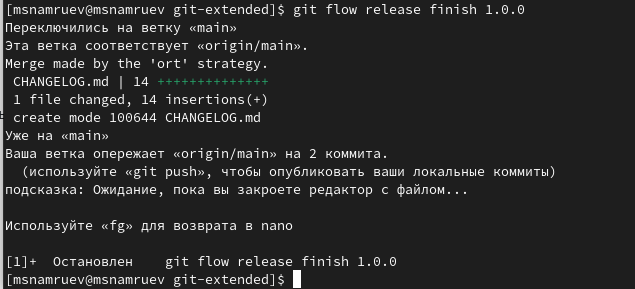

## Выполнение лабораторной работы

Отправляю данные на гитхаб.

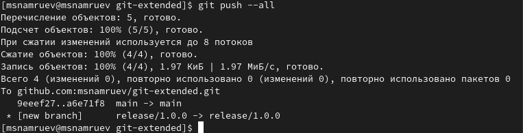

## Выполнение лабораторной работы

Создаю релиз на github 

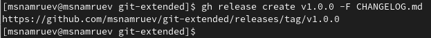

## Выполнение лабораторной работы

Создаю ветку для новой функциональности 

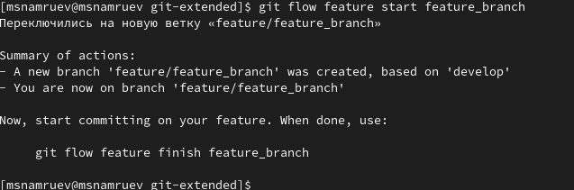

## Выполнение лабораторной работы

Объединяю ветку feature_branch с develop.

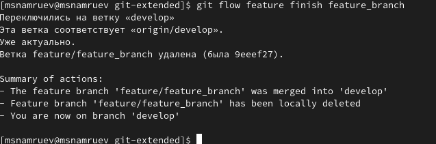

## Выполнение лабораторной работы

Создаю релиз с версией 1.2.3 

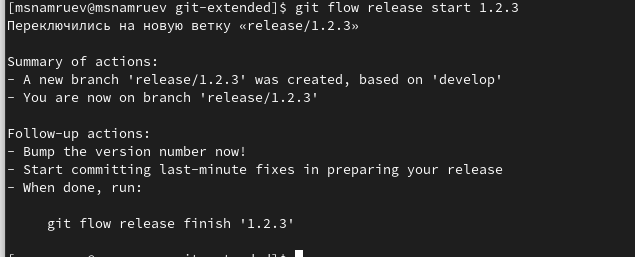

## Выполнение лабораторной работы

Обновляю номер версии в файле package.json.

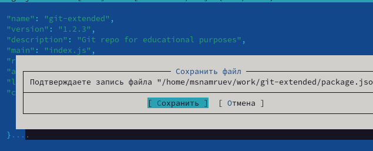

## Выполнение лабораторной работы

Создаю журнал изменений.

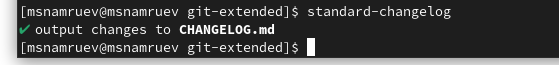

## Выполнение лабораторной работы

Добавляю журнал изменений в индекс.

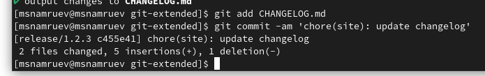

## Выполнение лабораторной работы

Заливаю релизную ветку в основную ветку.

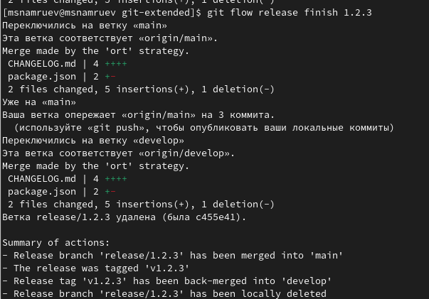

## Выполнение лабораторной работы

Отправляю данные на github.

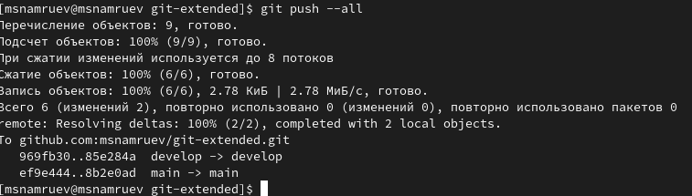

## Выполнение лабораторной работы

Создаю релиз на github с комментарием из журнала изменений.

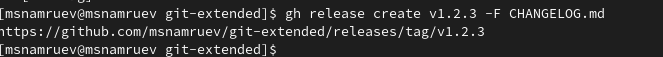

## Выводы

После выполнения данной лабораторной работы я приобрел навыки правильной работы с репозиториями git.

