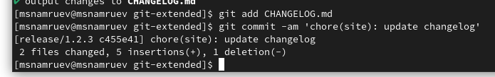

---
## Front matter
title: "Отчет по выполнению лабораторной работы №4"
subtitle: "Операционные системы"
author: "Намруев Максим Саналович"

## Generic otions
lang: ru-RU
toc-title: "Содержание"

## Bibliography
bibliography: bib/cite.bib
csl: pandoc/csl/gost-r-7-0-5-2008-numeric.csl

## Pdf output format
toc: true # Table of contents
toc-depth: 2
lof: true # List of figures
lot: true # List of tables
fontsize: 12pt
linestretch: 1.5
papersize: a4
documentclass: scrreprt
## I18n polyglossia
polyglossia-lang:
  name: russian
  options:
	- spelling=modern
	- babelshorthands=true
polyglossia-otherlangs:
  name: english
## I18n babel
babel-lang: russian
babel-otherlangs: english
## Fonts
mainfont: PT Sans
romanfont: PT Sans
sansfont: PT Sans
monofont: PT Sans
mainfontoptions: Ligatures=TeX
romanfontoptions: Ligatures=TeX
sansfontoptions: Ligatures=TeX,Scale=MatchLowercase
monofontoptions: Scale=MatchLowercase,Scale=0.9
## Biblatex
biblatex: true
biblio-style: "gost-numeric"
biblatexoptions:
  - parentracker=true
  - backend=biber
  - hyperref=auto
  - language=auto
  - autolang=other*
  - citestyle=gost-numeric
## Pandoc-crossref LaTeX customization
figureTitle: "Рис."
tableTitle: "Таблица"
listingTitle: "Листинг"
lofTitle: "Список иллюстраций"
lotTitle: "Список таблиц"
lolTitle: "Листинги"
## Misc options
indent: true
header-includes:
  - \usepackage{indentfirst}
  - \usepackage{float} # keep figures where there are in the text
  - \floatplacement{figure}{H} # keep figures where there are in the text
---

# Цель работы

Получение навыков правильной работы с репозиториями git.

# Задание

1. Выполнить работу для тестового репозитория.

2. Преобразовать рабочий репозиторий в репозиторий с git-flow и conventional commits.

# Выполнение лабораторной работы

Устанавливаю git-flow из коллекции репозиториев Copr (рис. [-@fig:001]). (рис. [-@fig:002]).

{#fig:001 width=70%}

{#fig:002 width=70%}

Устанавливаю Node.js (рис. [-@fig:003]).

{#fig:003 width=70%}

Запускаю pnpm.(рис. [-@fig:004]).

{#fig:004 width=70%}

Перелогиниваюсь и выполняю sourse ~/.bashrc (рис. [-@fig:005]).

{#fig:005 width=70%}

Выполненяю коммит commitizen.(рис. [-@fig:006]).

{#fig:006 width=70%}

Выполняю коммит standart-changelog (рис. [-@fig:007]).

{#fig:007 width=70%}

Создаю новый репозиторий git-extended.(рис. [-@fig:008]).

{#fig:008 width=70%}

Перехожу в папку work и клонирую его.(рис. [-@fig:009]).

{#fig:009 width=70%}

Перехожу в него и делаю первый коммит.(рис. [-@fig:010]).

{#fig:010 width=70%}

Далее выполняю конфигурацию для пакетов node.js.(рис. [-@fig:011]).

{#fig:011 width=70%}

Далее запоняю несколько параметров пакета.(рис. [-@fig:012]).

{#fig:012 width=70%}

Добавляю новые файлы и выпоняю коммит.(рис. [-@fig:013]).

{#fig:013 width=70%}

Далее отправляю файлы на github.(рис. [-@fig:014]).

{#fig:014 width=70%}

Инициализируем git-flow.(рис. [-@fig:015]).

{#fig:015 width=70%}

Проверяю, что нахожусь в ветке develop.(рис. [-@fig:016]).

{#fig:016 width=70%}

Загружаю весь репозиторий в хранилище.(рис. [-@fig:017]).

{#fig:017 width=70%}

Устанавливаю внешнюю ветку как вышестоящую для этой ветки.(рис. [-@fig:018]).

{#fig:018 width=70%}

Создаю релиз с версией 1.0.0 (рис. [-@fig:019]).

{#fig:019 width=70%}

Создаю журнал изменений.(рис. [-@fig:020]).

{#fig:020 width=70%}

Добавляю в журнал изменений индекс.(рис. [-@fig:021]).

{#fig:021 width=70%}

Заливаю релизную ветку в основную ветку.(рис. [-@fig:022]).

{#fig:022 width=70%}

Отправляю данные на гитхаб.(рис. [-@fig:023]). (рис. [-@fig:024]).

{#fig:023 width=70%}

{#fig:024 width=70%}

Создаю релиз на github (рис. [-@fig:025]).

{#fig:025 width=70%}

Создаю ветку для новой функциональности (рис. [-@fig:026]).

{#fig:026 width=70%}

Объединяю ветку feature_branch с develop.(рис. [-@fig:027]).

{#fig:027 width=70%}

Создаю релиз с версией 1.2.3 (рис. [-@fig:028]).

{#fig:028 width=70%}

Обновляю номер версии в файле package.json.(рис. [-@fig:029]).

{#fig:029 width=70%}

Создаю журнал изменений.(рис. [-@fig:030]).

{#fig:030 width=70%}

Добавляю журнал изменений в индекс.(рис. [-@fig:031]).

{#fig:031 width=70%}

Заливаю релизную ветку в основную ветку.(рис. [-@fig:032]).

{#fig:032 width=70%}

Отправляю данные на github.(рис. [-@fig:033]).(рис. [-@fig:034]).

{#fig:033 width=70%}

{#fig:034 width=70%}

Создаю релиз на github с комментарием из журнала изменений.(рис. [-@fig:035]).

{#fig:035 width=70%}

# Выводы

После выполнения данной лабораторной работы я приобрел навыки правильной работы с репозиториями git.

# Список литературы{.unnumbered}

::: {#refs}
:::
