---
## Front matter
lang: ru-RU
title: Лабораторная работа №5
subtitle: Операционные системы
author:
  - Намруев М. С
institute:
  - Российский университет дружбы народов, Москва, Россия
date: 16 марта 2024

## i18n babel
babel-lang: russian
babel-otherlangs: english

## Fonts
mainfont: PT Sans
romanfont: PT Sans
sansfont: PT Sans
monofont: PT Sans
mainfontoptions: Ligatures=TeX
romanfontoptions: Ligatures=TeX
sansfontoptions: Ligatures=TeX,Scale=MatchLowercase
monofontoptions: Scale=MatchLowercase,Scale=0.9

## Formatting pdf
toc: false
toc-title: Содержание
slide_level: 2
aspectratio: 169
section-titles: true
theme: metropolis
header-includes:
 - \metroset{progressbar=frametitle,sectionpage=progressbar,numbering=fraction}
 - '\makeatletter'
 - '\beamer@ignorenonframefalse'
 - '\makeatother'
---

## Докладчик

:::::::::::::: {.columns align=center}
::: {.column width="70%"}

  * Намруев Максим Саналович
  * Студент, 1 курс, НКАбд-04-23
  * Российский университет дружбы народов
  * [1132236035@rudn.ru](mailto:1132236035@rudn.ru)
  * <https://msnamruev.github.io/ru/>

:::
::: {.column width="30%"}

:::
::::::::::::::

## Цель работы

Настройка рабочей среды.

## Задание

1. Менеджер паролей pass

2. Управление файлами конфигурации

3. Дополнительное программное обеспечение

## Выполнение лабораторной работы

Устанавливаю pass на fedora

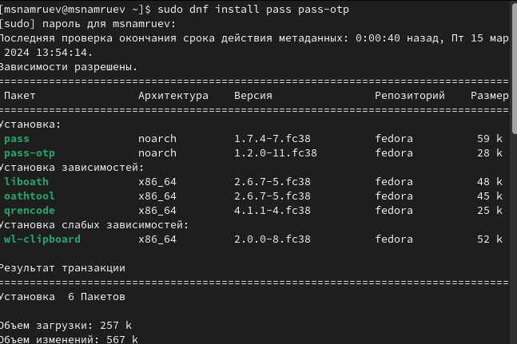

## Выполнение лабораторной работы

Устанавливаю gopass.

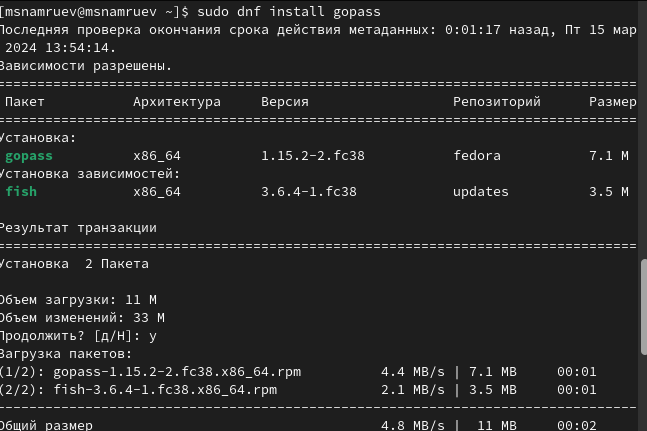

## Выполнение лабораторной работы

Инициализирую хранилище.

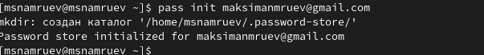

## Выполнение лабораторной работы

Создаю структуру git.

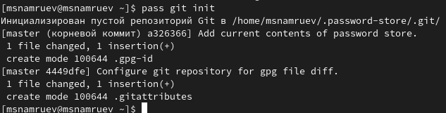

## Выполнение лабораторной работы

Для синхронизации хранилища выполняю следующие команды.

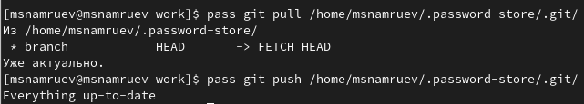

## Выполнение лабораторной работы

Делаю изменения непосредственно на файловой системе.

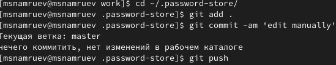

## Выполнение лабораторной работы

Проверю статус модной командой.

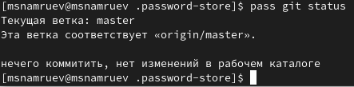

## Выполнение лабораторной работы

Устанавливаю расширение на firefox.

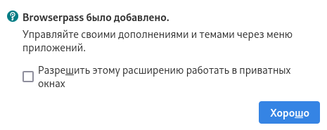

## Выполнение лабораторной работы

Устанавливаю интерфейс native messaging.

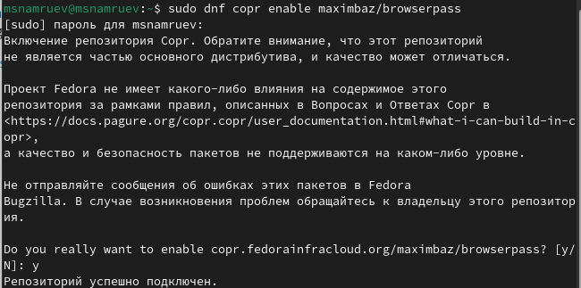

## Выполнение лабораторной работы

Добавляю новый пароль .

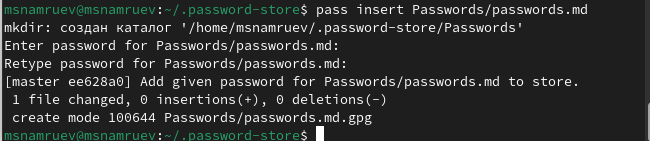

## Выполнение лабораторной работы

Заменяю существующий пароль.

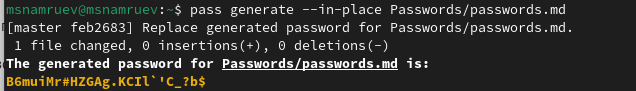

## Выполнение лабораторной работы

Устанавлюваю доп. программное обеспечение.

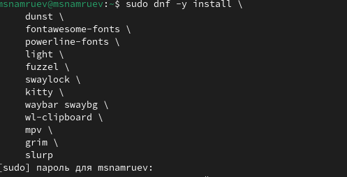

## Выполнение лабораторной работы

Устанавливаю бинарный файл .

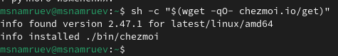

## Выполнение лабораторной работы

Создаю свой репозиторий на основе шаблона.

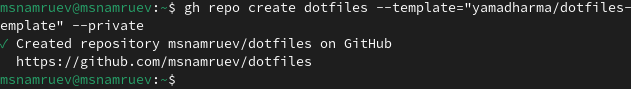

## Выполнение лабораторной работы

Инициализирую chezmoi с моим репозиторием dotfiles.

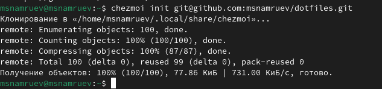

## Выполнение лабораторной работы

Проверяю какие изменения внесет chezmoi в домашний каталог.

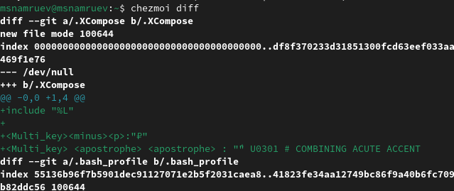

## Выполнение лабораторной работы

Так как меня истраивают изменения запускаю chezmoi apply -v.

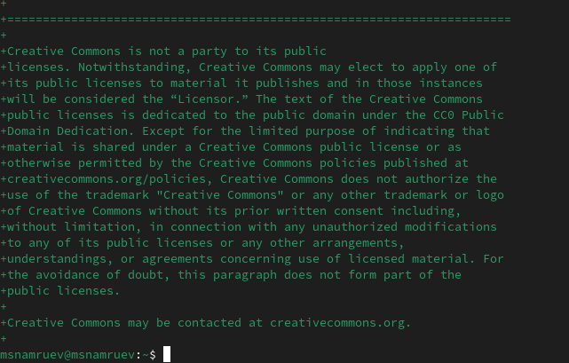

## Выполнение лабораторной работы

Извлекаю изменения из репозитория..

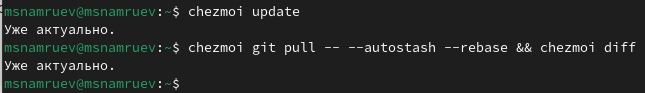

## Выводы

После выполнения данной работы я настроил рабочую среду

