---
## Front matter
lang: ru-RU
title: Лабораторная работа №6
subtitle: Операционные системы
author:
  - Намруев М. С.
institute:
  - Российский университет дружбы народов, Москва, Россия
date: 16 марта 2024

## i18n babel
babel-lang: russian
babel-otherlangs: english

## Fonts
mainfont: PT Sans
romanfont: PT Sans
sansfont: PT Sans
monofont: PT Sans
mainfontoptions: Ligatures=TeX
romanfontoptions: Ligatures=TeX
sansfontoptions: Ligatures=TeX,Scale=MatchLowercase
monofontoptions: Scale=MatchLowercase,Scale=0.9

## Formatting pdf
toc: false
toc-title: Содержание
slide_level: 2
aspectratio: 169
section-titles: true
theme: metropolis
header-includes:
 - \metroset{progressbar=frametitle,sectionpage=progressbar,numbering=fraction}
 - '\makeatletter'
 - '\beamer@ignorenonframefalse'
 - '\makeatother'
---

## Докладчик

:::::::::::::: {.columns align=center}
::: {.column width="70%"}

  * Намруев Максим Саналович
  * студент, 1 курс, НКАбд-04-23
  * Российский университет дружбы народов
  * [1132236035@rudn.ru](mailto:1132236035@rudn.ru)
  * <https://msnamruev.github.io/ru/>

:::
::: {.column width="30%"}

:::
::::::::::::::

## Цель работы

Приобретение практических навыков взаимодействия пользователя с системой посредством командной строки

## Выполнение лабораторной работы

Определяю полное имя мое домашнего каталога 

## Выполнение лабораторной работы

Перехожу в каталог /tmp и вывожу его содержимое разными командами.

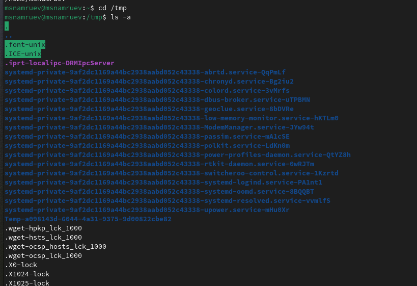

## Выполнение лабораторной работы

Определяю есть ли в каталоге /var/spool подкаталог и именем cron 

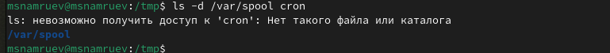

## Выполнение лабораторной работы

Перехожу в мой домашний каталог и вывожу на экран его содержимое, определяя, кто является владельцем файлов.

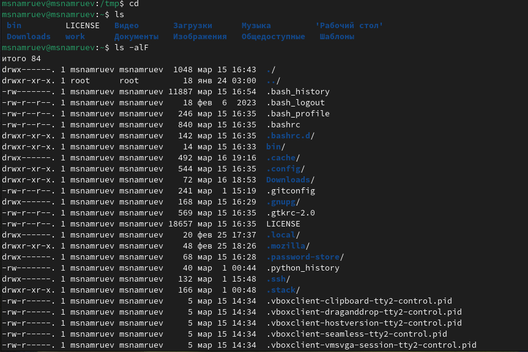

## Выполнение лабораторной работы

Создаю каталог newdir

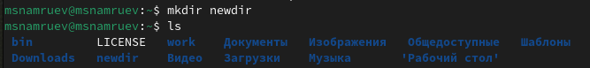

## Выполнение лабораторной работы

В нем создаю каталог morefun

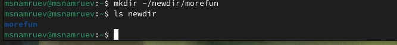

## Выполнение лабораторной работы

Далее одной командой создаю 3 каталога и удаляю их

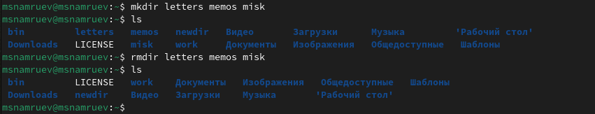

## Выполнение лабораторной работы

Пытаюсь удалить каталог newdir командой rm

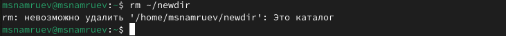

## Выполнение лабораторной работы

Удаляю каталог morefun

## Выполнение лабораторной работы

Определяю с помощью какой команды можно вывести сожержимое не только указаного каталога, но и подкаталогов

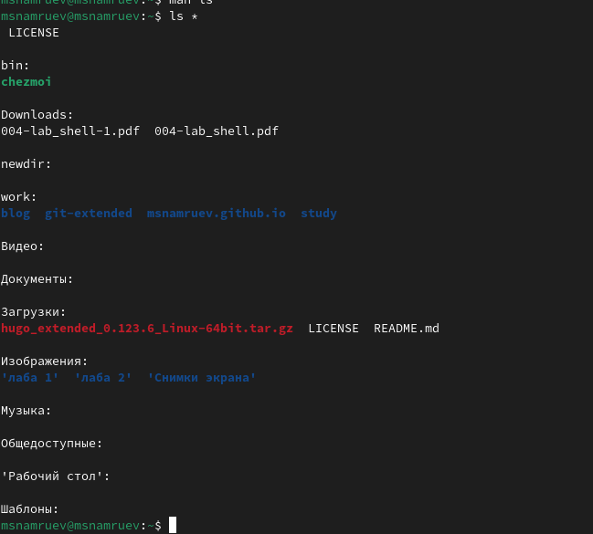

## Выполнение лабораторной работы

С помощью команды man определяю  набор опций команды ls, позволяющий отсортировать по времени последнего изменения выводимый список содержимого каталога с развёрнутым описанием файлов

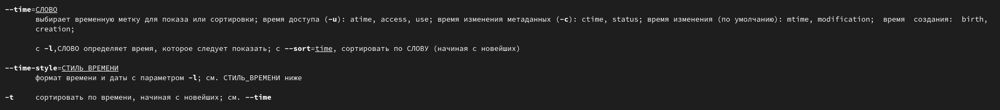

## Выполнение лабораторной работы

Использую команду man для просмотра описания команд cd, pwd, mkdir, rmdir, rm.

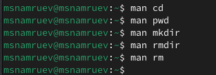

## Выполнение лабораторной работы

выполняю модификацию и исполнение команды из буфера команд

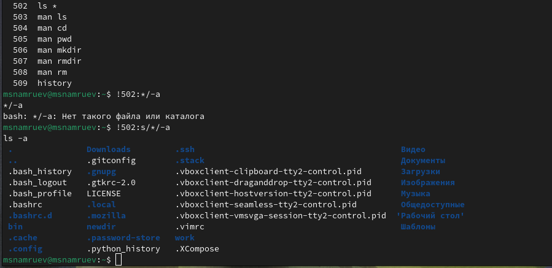

## Выводы

После выполнения данной лабораторной работы я приобрел навыки взаимодействия пользователя с системой посредством командной строки
