---
## Front matter
lang: ru-RU
title: Лабораторная работа №7
subtitle: Операционные системы
author:
  - Намруев М.С.
institute:
  - Российский университет дружбы народов, Москва, Россия
date: 23 марта 2024

## i18n babel
babel-lang: russian
babel-otherlangs: english

## Fonts
mainfont: PT Sans
romanfont: PT Sans
sansfont: PT Sans
monofont: PT Sans
mainfontoptions: Ligatures=TeX
romanfontoptions: Ligatures=TeX
sansfontoptions: Ligatures=TeX,Scale=MatchLowercase
monofontoptions: Scale=MatchLowercase,Scale=0.9

## Formatting pdf
toc: false
toc-title: Содержание
slide_level: 2
aspectratio: 169
section-titles: true
theme: metropolis
header-includes:
 - \metroset{progressbar=frametitle,sectionpage=progressbar,numbering=fraction}
 - '\makeatletter'
 - '\beamer@ignorenonframefalse'
 - '\makeatother'
---

## Докладчик

:::::::::::::: {.columns align=center}
::: {.column width="70%"}

  * Намруев Максим Саналовч
  * студент, 1 курс, НКАбд-04-23
  * Российский университет дружбы народов
  * [1132236035@rudn.ru](mailto:1132236035@rudn.ru)
  * <https://msnamruev.github.io/ru/>

:::
::: {.column width="30%"}

:::
::::::::::::::

## Цель работы

Ознакомление с файловой системой Linux, её структурой, именами и содержанием
каталогов. Приобретение практических навыков по применению команд для работы
с файлами и каталогами, по управлению процессами (и работами), по проверке исполь-
зования диска и обслуживанию файловой системы.

## Выполнение лабораторной работы

выполняю все примеры, приведенные в первой части описания лабораторной работы.

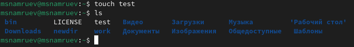

## Выполнение лабораторной работы

Копирую файл io.h в домашний каталог и называю его equipment.

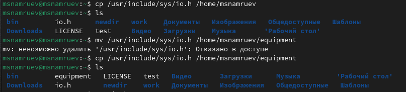

## Выполнение лабораторной работы

В домашнем каталоге создаю директорию ski.plases.

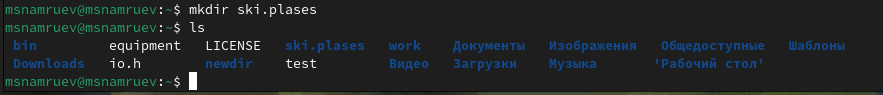

## Выполнение лабораторной работы

Перемещаю файл equipment в каталог ski.plases.

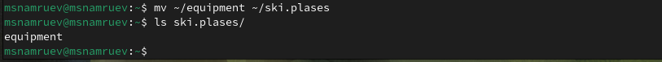

## Выполнение лабораторной работы

Переименовываю файл equipment в equiplist.

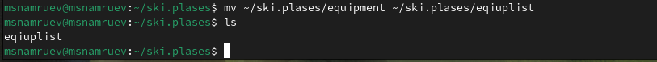

## Выполнение лабораторной работы

Создаю в домашнем каталоге файл abc1 и копирую его в ski.plases, назвав его equiplist2. 

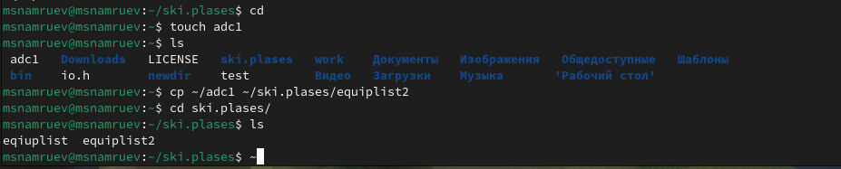

## Выполнение лабораторной работы

Создаю каталог с именем equipment в ski.plases. 

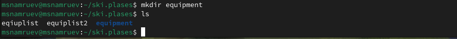

## Выполнение лабораторной работы

Перемещаю файлы equiplist и equiplist2 в каталог equipment. 

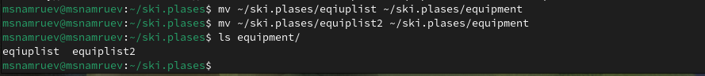

## Выполнение лабораторной работы

Создаю новый каталог newdir и перемещаю его в ski.plases, назвав его plans. 

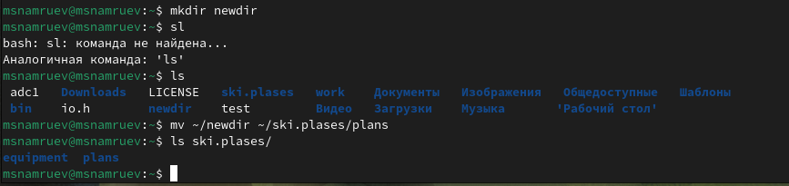

## Выполнение лабораторной работы

Определяю операции команды chmod, необходимые для того, чтобы присвоить файлам выделенные права доступа.

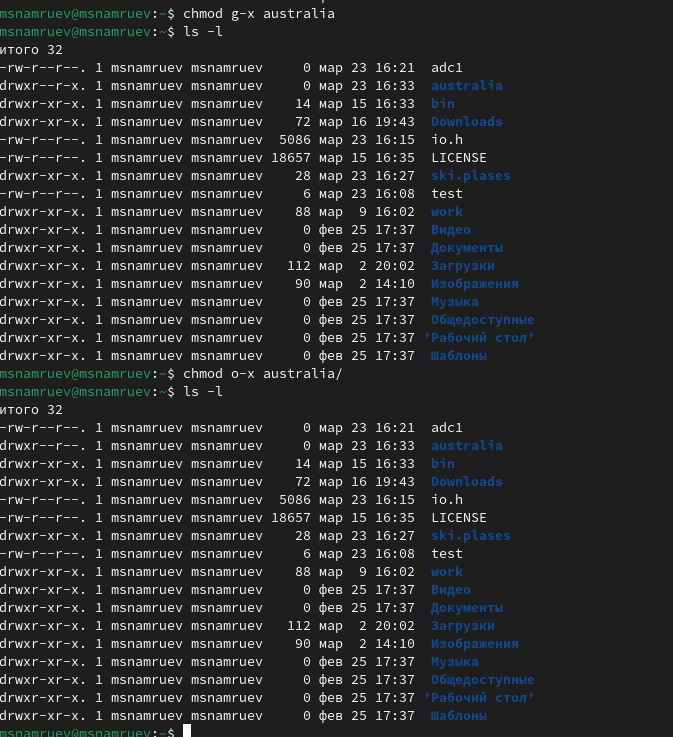

## Выполнение лабораторной работы

Просматриваю содержимое файла /etc/passwd.

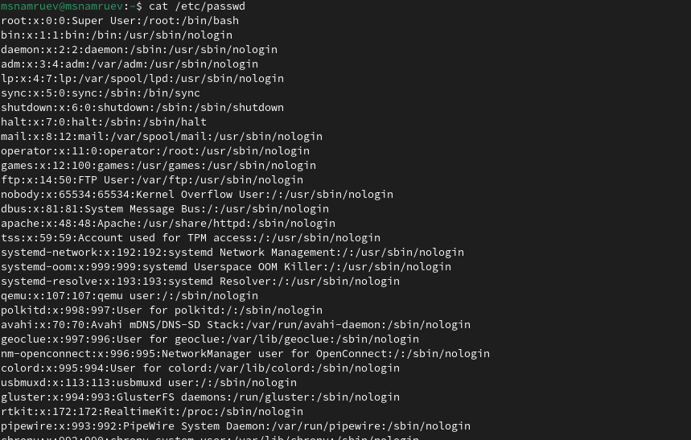

## Выполнение лабораторной работы

Копирую файл feathers в файл file.old .

## Выполнение лабораторной работы

Перемещаю файл file.old в каталог play 

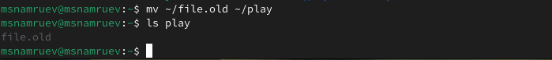

## Выполнение лабораторной работы

Копирую каталог play в каталог fun.

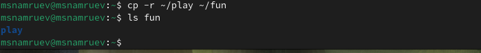

## Выполнение лабораторной работы

Перемешаю каталог fun в play.

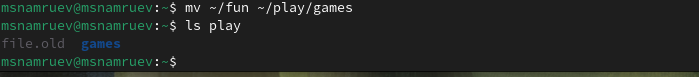

## Выполнение лабораторной работы

Лишаю владельца файла feathers права на чтение.

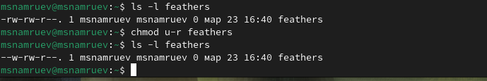

## Выполнение лабораторной работы

Пытаюсь посмотреть файл командой cat.

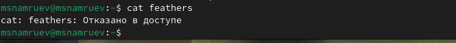

## Выполнение лабораторной работы

Пытаюсь скопировать файл feathers.

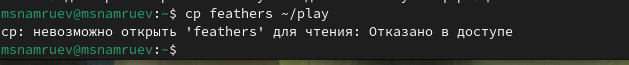

## Выполнение лабораторной работы

Даю владельцу право на чтение feathers.

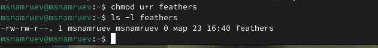

## Выполнение лабораторной работы

Лишаю владельца права на выполение каталога play.

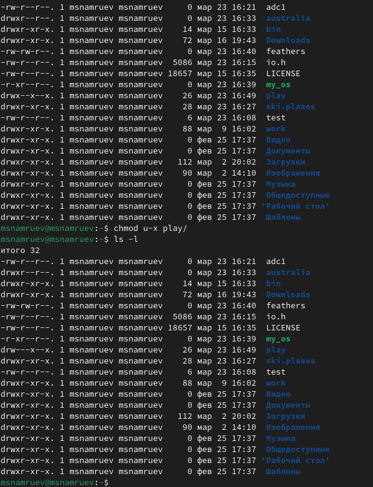

## Выполнение лабораторной работы

Пытаюсь перейти в каталог play.

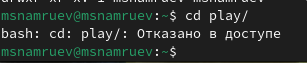

## Выполнение лабораторной работы

Даю владельцу право на выполение play.

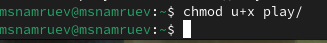

## Выполнение лабораторной работы

Читаю man по командам mount,fsck,kill.

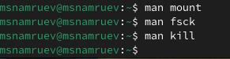

## Выводы

После выполение данной лабораторной работы я ознакомился с файловой системой linux, её структуройЮ именами и содержанием каталогов.
