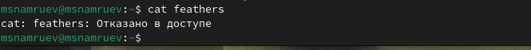

---
## Front matter
title: "Отчет по лабораторной работе №7"
subtitle: "Операционные системы"
author: "Намруев Максим Саналович"

## Generic otions
lang: ru-RU
toc-title: "Содержание"

## Bibliography
bibliography: bib/cite.bib
csl: pandoc/csl/gost-r-7-0-5-2008-numeric.csl

## Pdf output format
toc: true # Table of contents
toc-depth: 2
lof: true # List of figures
lot: true # List of tables
fontsize: 12pt
linestretch: 1.5
papersize: a4
documentclass: scrreprt
## I18n polyglossia
polyglossia-lang:
  name: russian
  options:
	- spelling=modern
	- babelshorthands=true
polyglossia-otherlangs:
  name: english
## I18n babel
babel-lang: russian
babel-otherlangs: english
## Fonts
mainfont: PT Sans
romanfont: PT Sans
sansfont: PT Sans
monofont: PT Sans
mainfontoptions: Ligatures=TeX
romanfontoptions: Ligatures=TeX
sansfontoptions: Ligatures=TeX,Scale=MatchLowercase
monofontoptions: Scale=MatchLowercase,Scale=0.9
## Biblatex
biblatex: true
biblio-style: "gost-numeric"
biblatexoptions:
  - parentracker=true
  - backend=biber
  - hyperref=auto
  - language=auto
  - autolang=other*
  - citestyle=gost-numeric
## Pandoc-crossref LaTeX customization
figureTitle: "Рис."
tableTitle: "Таблица"
listingTitle: "Листинг"
lofTitle: "Список иллюстраций"
lotTitle: "Список таблиц"
lolTitle: "Листинги"
## Misc options
indent: true
header-includes:
  - \usepackage{indentfirst}
  - \usepackage{float} # keep figures where there are in the text
  - \floatplacement{figure}{H} # keep figures where there are in the text
---

# Цель работы

Ознакомление с файловой системой Linux, её структурой, именами и содержанием
каталогов. Приобретение практических навыков по применению команд для работы
с файлами и каталогами, по управлению процессами (и работами), по проверке исполь-
зования диска и обслуживанию файловой системы.

# Выполнение лабораторной работы

выполняю все примеры, приведенные в первой части описания лабораторной работы.(рис. [-@fig:001]).(рис. [-@fig:002]).(рис. [-@fig:003]).(рис. [-@fig:004]).(рис. [-@fig:005]).(рис. [-@fig:006]).

{#fig:001 width=70%}

{#fig:002 width=70%}

{#fig:003 width=70%}

{#fig:004 width=70%}

{#fig:005 width=70%}

{#fig:006 width=70%}

Копирую файл io.h в домашний каталог и называю его equipment.(рис. [-@fig:007]).

{#fig:007 width=70%}

В домашнем каталоге создаю директорию ski.plases.(рис. [-@fig:008]).

{#fig:008 width=70%}

Перемещаю файл equipment в каталог ski.plases.(рис. [-@fig:009]).

{#fig:009 width=70%}

Переименовываю файл equipment в equiplist.(рис. [-@fig:010]).

{#fig:010 width=70%}

Создаю в домашнем каталоге файл abc1 и копирую его в ski.plases, назвав его equiplist2. (рис. [-@fig:011]).

{#fig:011 width=70%}

Создаю каталог с именем equipment в ski.plases. (рис. [-@fig:012]).

{#fig:012 width=70%}

Перемещаю файлы equiplist и equiplist2 в каталог equipment. (рис. [-@fig:013]).

{#fig:013 width=70%}

Создаю новый каталог newdir и перемещаю его в ski.plases, назвав его plans. (рис. [-@fig:014]).

{#fig:014 width=70%}

Определяю операции команды chmod, необходимые для того, чтобы присвоить файлам выделенные права доступа.(рис. [-@fig:015]).(рис. [-@fig:016]).(рис. [-@fig:017]).(рис. [-@fig:018]).

{#fig:015 width=70%}

{#fig:016 width=70%}

{#fig:017 width=70%}

{#fig:018 width=70%}

Просматриваю содержимое файла /etc/passwd.(рис. [-@fig:019]).

{#fig:019 width=70%}

Копирую файл feathers в файл file.old .(рис. [-@fig:020]).

{#fig:020 width=70%}

Перемещаю файл file.old в каталог play .(рис. [-@fig:021]).

{#fig:021 width=70%}

Копирую каталог play в каталог fun.(рис. [-@fig:023]).

{#fig:023 width=70%}

Перемешаю каталог fun в play.(рис. [-@fig:024]).

{#fig:024 width=70%}

Лишаю владельца файла feathers права на чтение.(рис. [-@fig:025]).

{#fig:025 width=70%}

Пытаюсь посмотреть файл командой cat.(рис. [-@fig:026]).

{#fig:026 width=70%}

Пытаюсь скопировать файл feathers.(рис. [-@fig:027]).

{#fig:027 width=70%}

Даю владельцу право на чтение feathers.(рис. [-@fig:028]).

{#fig:028 width=70%}

Лишаю владельца права на выполение каталога play.(рис. [-@fig:029]).

{#fig:029 width=70%}

Пытаюсь перейти в каталог play.(рис. [-@fig:030]).

{#fig:030 width=70%}

Даю владельцу право на выполение play.(рис. [-@fig:031]).

{#fig:031 width=70%}

Читаю man по командам mount,fsck,kill.(рис. [-@fig:032]).

{#fig:032 width=70%}

# Выводы

После выполение данной лабораторной работы я ознакомился с файловой системой linux, её структуройЮ именами и содержанием каталогов.

