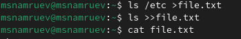
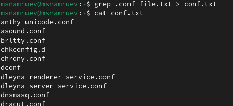
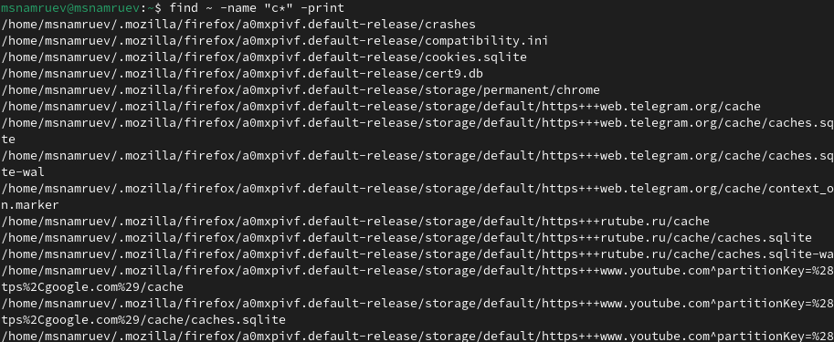
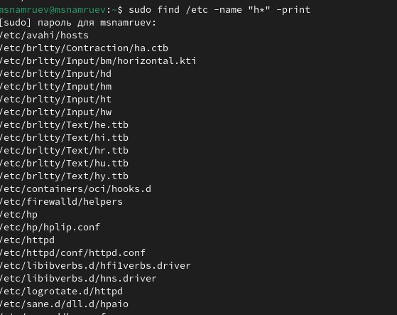
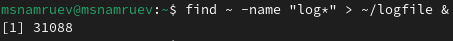
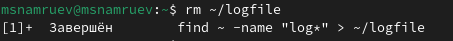
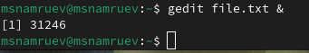
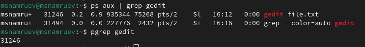
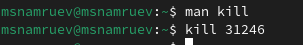
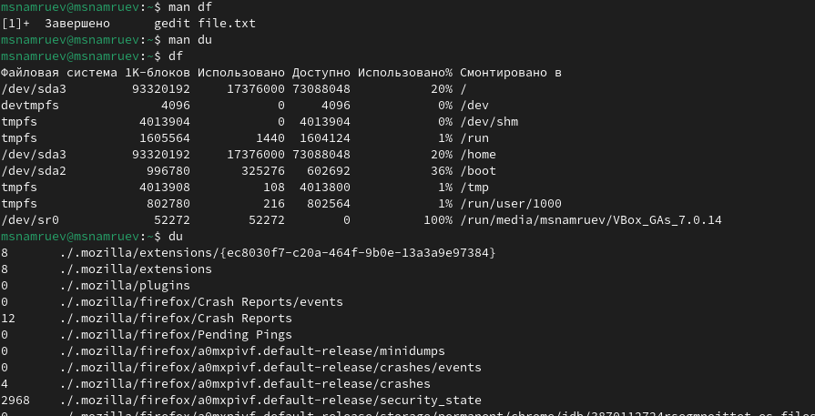

---
## Front matter
lang: ru-RU
title: Лабораторная работа №8
subtitle: Операционные системы
author:
  - Намруев М. С.
institute:
  - Российский университет дружбы народов, Москва, Россия
date: 30 марта 2024

## i18n babel
babel-lang: russian
babel-otherlangs: english
## Fonts
mainfont: PT Sans
romanfont: PT Sans
sansfont: PT Sans
monofont: PT Sans
mainfontoptions: Ligatures=TeX
romanfontoptions: Ligatures=TeX
sansfontoptions: Ligatures=TeX,Scale=MatchLowercase
monofontoptions: Scale=MatchLowercase,Scale=0.9
## Formatting pdf
toc: false
toc-title: Содержание
slide_level: 2
aspectratio: 169
section-titles: true
theme: metropolis
header-includes:
 - \metroset{progressbar=frametitle,sectionpage=progressbar,numbering=fraction}
 - '\makeatletter'
 - '\beamer@ignorenonframefalse'
 - '\makeatother'
---

## Докладчик

:::::::::::::: {.columns align=center}
::: {.column width="70%"}

  * Намруев Максим Саналович
  * студент, 1 курс, НКАбд-04-23
  * Российский университет дружбы народов
  * [1132236035@rudn.ru](mailto:1132236035@rudn.ru)
  * <https://msnamruev.github.io/ru/>

:::
::: {.column width="30%"}

:::
::::::::::::::

## Цель работы

Ознакомление с инструментами поиска файлов и фильтрации текстовых данных.
Приобретение практических навыков: по управлению процессами (и заданиями), по
проверке использования диска и обслуживанию файловых систем.

## Задание

1. Осуществите вход в систему, используя соответствующее имя пользователя.

2. Запишите в файл file.txt названия файлов, содержащихся в каталоге /etc. Допишите в этот же файл названия файлов, содержащихся в вашем домашнем каталоге.

3. Выведите имена всех файлов из file.txt, имеющих расширение .conf, после чего запишите их в новый текстовой файл conf.txt.

4. Определите, какие файлы в вашем домашнем каталоге имеют имена, начинавшиеся с символа c? Предложите несколько вариантов, как это сделать.

5. Выведите на экран (по странично) имена файлов из каталога /etc, начинающиеся с символа h.

6. Запустите в фоновом режиме процесс, который будет записывать в файл ~/logfile файлы, имена которых начинаются с log.

7. Удалите файл ~/logfile.

8. Запустите из консоли в фоновом режиме редактор gedit.

9. Определите идентификатор процесса gedit, используя команду ps, конвейер и фильтр grep. Как ещё можно определить идентификатор процесса?

10. Прочтите справку (man) команды kill, после чего используйте её для завершения процесса gedit.

11. Выполните команды df и du, предварительно получив более подробную информацию об этих командах, с помощью команды man.

12. Воспользовавшись справкой команды find, выведите имена всех директорий, имеющихся в вашем домашнем каталоге

## Выполнение лабораторной работы

Осуществляю вход в систему, используя соответствующее имя пользователя. 

## Выполнение лабораторной работы

Записываю в файл file.txt название файлов из каталога /etc и дописываю в тот же файл названия файлов их домашниего каталога 

## Выполнение лабораторной работы

Записываю имена всех файлов из file.txt, имеющих разширение .conf в файл conf.txt

## Выполнение лабораторной работы

Определяю какие файлы в моём домашнем каталге имеют имена, начинающиеся с символа с.

## Выполнение лабораторной работы

Вывожу на экран имена файлов из каталога /etc, начинающихся с символа h

## Выполнение лабораторной работы

Запускаю в фоновом режиме процесс, который записывает в файл ~/logfile файлы, имена которых начинаются с log.

## Выполнение лабораторной работы

Удаляю файл ~/logfile

## Выполнение лабораторной работы

Запускаю в фоновом режиме редактор gedit.

## Выполнение лабораторной работы

Определяю идентификатор процесса gedit, используя команду ps, конвейер и фильтр grep

## Выполнение лабораторной работы

Использую команду kill myself для завершения процесса моей жизни.

## Выполнение лабораторной работы

Использую команды df и du.

## Выполнение лабораторной работы

Вывожу имена всех директорий в моём домашнем каталоге.

## Выводы

После выполнение данной лабораторной работы я ознакомился с инструментами поиска файлов и фильтрации текстовых данных.

