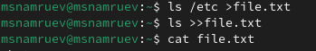
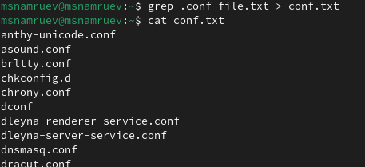
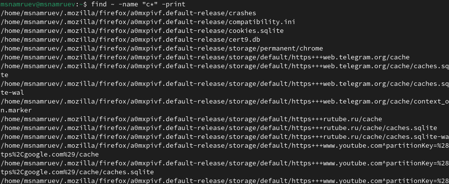
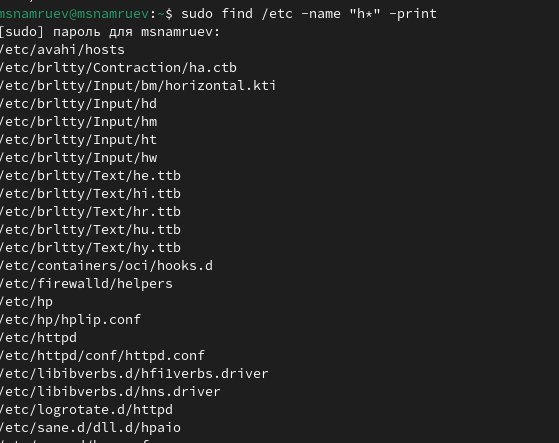
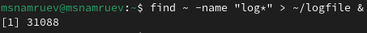
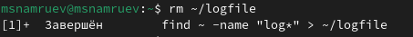
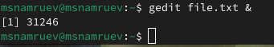
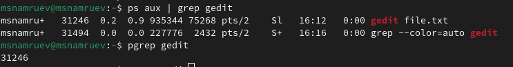
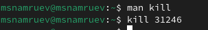
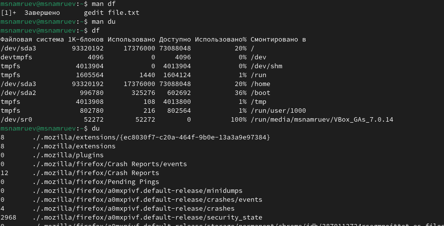

---
## Front matter
title: "Лабораторная работа №8"
subtitle: "Операционные системы"
author: "Намруев Максим Саналович"

## Generic otions
lang: ru-RU
toc-title: "Содержание"

## Bibliography
bibliography: bib/cite.bib
csl: pandoc/csl/gost-r-7-0-5-2008-numeric.csl

## Pdf output format
toc: true # Table of contents
toc-depth: 2
lof: true # List of figures
lot: true # List of tables
fontsize: 12pt
linestretch: 1.5
papersize: a4
documentclass: scrreprt
## I18n polyglossia
polyglossia-lang:
  name: russian
  options:
	- spelling=modern
	- babelshorthands=true
polyglossia-otherlangs:
  name: english
## I18n babel
babel-lang: russian
babel-otherlangs: english
## Fonts
mainfont: PT Sans
romanfont: PT Sans
sansfont: PT Sans
monofont: PT Sans
mainfontoptions: Ligatures=TeX
romanfontoptions: Ligatures=TeX
sansfontoptions: Ligatures=TeX,Scale=MatchLowercase
monofontoptions: Scale=MatchLowercase,Scale=0.9
## Biblatex
biblatex: true
biblio-style: "gost-numeric"
biblatexoptions:
  - parentracker=true
  - backend=biber
  - hyperref=auto
  - language=auto
  - autolang=other*
  - citestyle=gost-numeric
## Pandoc-crossref LaTeX customization
figureTitle: "Рис."
tableTitle: "Таблица"
listingTitle: "Листинг"
lofTitle: "Список иллюстраций"
lotTitle: "Список таблиц"
lolTitle: "Листинги"
## Misc options
indent: true
header-includes:
  - \usepackage{indentfirst}
  - \usepackage{float} # keep figures where there are in the text
  - \floatplacement{figure}{H} # keep figures where there are in the text
---

# Цель работы

Ознакомление с инструментами поиска файлов и фильтрации текстовых данных.
Приобретение практических навыков: по управлению процессами (и заданиями), по
проверке использования диска и обслуживанию файловых систем.

# Задание

1. Осуществите вход в систему, используя соответствующее имя пользователя.

2. Запишите в файл file.txt названия файлов, содержащихся в каталоге /etc. Допишите в этот же файл названия файлов, содержащихся в вашем домашнем каталоге.

3. Выведите имена всех файлов из file.txt, имеющих расширение .conf, после чего запишите их в новый текстовой файл conf.txt.

4. Определите, какие файлы в вашем домашнем каталоге имеют имена, начинавшиеся с символа c? Предложите несколько вариантов, как это сделать.

5. Выведите на экран (по странично) имена файлов из каталога /etc, начинающиеся с символа h.

6. Запустите в фоновом режиме процесс, который будет записывать в файл ~/logfile файлы, имена которых начинаются с log.

7. Удалите файл ~/logfile.

8. Запустите из консоли в фоновом режиме редактор gedit.

9. Определите идентификатор процесса gedit, используя команду ps, конвейер и фильтр grep. Как ещё можно определить идентификатор процесса?

10. Прочтите справку (man) команды kill, после чего используйте её для завершения процесса gedit.

11. Выполните команды df и du, предварительно получив более подробную информацию об этих командах, с помощью команды man.

12. Воспользовавшись справкой команды find, выведите имена всех директорий, имеющихся в вашем домашнем каталоге

# Выполнение лабораторной работы

Осуществляю вход в систему, используя соответствующее имя пользователя. 

Записываю в файл file.txt название файлов из каталога /etc и дописываю в тот же файл названия файлов их домашниего каталога (рис. [-@fig:001]).

{#fig:001 width=70%}

Записываю имена всех файлов из file.txt, имеющих разширение .conf в файл conf.txt(рис. [-@fig:002]).

{#fig:002 width=70%}

Определяю какие файлы в моём домашнем каталге имеют имена, начинающиеся с символа с.(рис. [-@fig:003]).

{#fig:003 width=70%}

Вывожу на экран имена файлов из каталога /etc, начинающихся с символа h(рис. [-@fig:004]).

{#fig:004 width=70%}

Запускаю в фоновом режиме процесс, который записывает в файл ~/logfile файлы, имена которых начинаются с log.(рис. [-@fig:005]).

{#fig:005 width=70%}

Удаляю файл ~/logfile(рис. [-@fig:006]).

{#fig:006 width=70%}

Запускаю в фоновом режиме редактор gedit.(рис. [-@fig:007]).

{#fig:007 width=70%}

Определяю идентификатор процесса gedit, используя команду ps, конвейер и фильтр grep(рис. [-@fig:008]).

{#fig:008 width=70%}

Использую команду kill myself для завершения процесса моей жизни.(рис. [-@fig:009]).

{#fig:009 width=70%}

Использую команды df и du.(рис. [-@fig:010]).

{#fig:010 width=70%}

Вывожу имена всех директорий в моём домашнем каталоге.(рис. [-@fig:011]).

{#fig:011 width=70%}

# Выводы

После выполнение данной лабораторной работы я ознакомился с инструментами поиска файлов и фильтрации текстовых данных.

