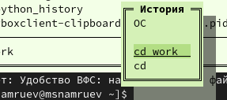

---
## Front matter
lang: ru-RU
title: Лабораторная работа №9
subtitle: Операционные системы
author:
  - Намруев М. С.
institute:
  - Российский университет дружбы народов, Москва, Россия
date: 06 апреля 2024

## i18n babel
babel-lang: russian
babel-otherlangs: english

## Fonts
mainfont: PT Sans
romanfont: PT Sans
sansfont: PT Sans
monofont: PT Sans
mainfontoptions: Ligatures=TeX
romanfontoptions: Ligatures=TeX
sansfontoptions: Ligatures=TeX,Scale=MatchLowercase
monofontoptions: Scale=MatchLowercase,Scale=0.9

## Formatting pdf
toc: false
toc-title: Содержание
slide_level: 2
aspectratio: 169
section-titles: true
theme: metropolis
header-includes:
 - \metroset{progressbar=frametitle,sectionpage=progressbar,numbering=fraction}
 - '\makeatletter'
 - '\beamer@ignorenonframefalse'
 - '\makeatother'
---

## Докладчик

:::::::::::::: {.columns align=center}
::: {.column width="70%"}

  * Намруев Максим Саналович
  * 1 курс, студент, НКАбд-04-23
  * Российский университет дружбы народов
  * [1132236035@rudn.ru](mailto:1132236035@rudn.ru)
  * <https://msnamruev.github.io/ru/>

:::
::: {.column width="30%"}

:::
::::::::::::::

## Цель работы

Освоение основных возможностей командной оболочки Midnight Commander. Приобретение навыков практической работы по просмотру каталогов и файлов; манипуляций с ними

## Задание

1. Задания по MC.

2. Задания по встроенному редактору mc.

## Выполнение лабораторной работы

Изучаю информацию о mc, вызвав в командной скроке man mc 

## Выполнение лабораторной работы

Запускаю из командной строки mc, изучаю его структуру и меню.

## Выполнение лабораторной работы

Выполняю несколько операций mc.

## Выполнение лабораторной работы

## Выполнение лабораторной работы

## Выполнение лабораторной работы

## Выполнение лабораторной работы

## Выполнение лабораторной работы

## Выполнение лабораторной работы

## Выполнение лабораторной работы

Выполняю основные команды меню левой панели.

## Выполнение лабораторной работы

## Выполнение лабораторной работы

## Выполнение лабораторной работы

Используя возможности подменю "Файл", выполняю:

1. Просмотр содержимого файла.

## Выполнение лабораторной работы

2. Редактирование содердимого файла.

## Выполнение лабораторной работы

3. Создание каталога.

## Выполнение лабораторной работы

4. копирование файла в созданный каталог.

## Выполнение лабораторной работы

С помощью соответствующих средств подменю "Команда" осуществляю:

1. поиск в файловой системе файла с заданными условиями.

## Выполнение лабораторной работы

## Выполнение лабораторной работы

2. выбор и повторение одной из предыдущих команд.

## Выполнение лабораторной работы

3. переход в домашний каталог. 

## Выполнение лабораторной работы

4. анализ файла меню и файла расширений.

## Выполнение лабораторной работы

## Выполнение лабораторной работы

Вызываю подменю "Настройки". Осваиваю операции определяющие структуру экрана mc.

## Выполнение лабораторной работы

Создаю файл text.txt.

## Выполнение лабораторной работы

Открываю его с помощью втроенного редактора mc и вставляю в него небольшой фрагмент текста скопированного из Интернета.

## Выполнение лабораторной работы

Удаляю строку текста.

## Выполнение лабораторной работы

Выделяю фрагмент текста и копирую его на новую строку

## Выполнение лабораторной работы

Выделяю фрагмент текста и и переношу его на новую строку 

## Выполнение лабораторной работы

Сохраняю файл.

## Выполнение лабораторной работы

Отменяю последнее действие.

## Выполнение лабораторной работы

Перехожу в начало файла и пишу некоторый текст, потом перехожу в конец файла и пишу там некоторый текст.

## Выполнение лабораторной работы

Сохраняю и закрываю файл.

## Выполнение лабораторной работы

Открываю файл с исходным текстом на языке с++.

## Выполнение лабораторной работы

Включаю подсветку.

## Выводы

После данной лабораторной работы я освоил основные возможности командной оболочки mc, приобрел навыки практической работы по просмотру каталогов и файлов, манипуляций с ними.

