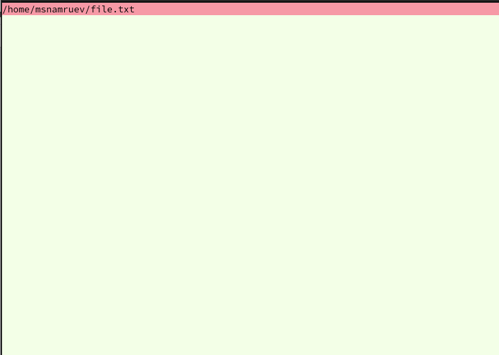
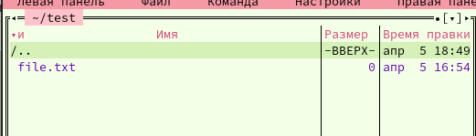

---
## Front matter
title: "Лабораторная работа №9"
subtitle: "Операционные системы"
author: "Намруев Максим Саналович"

## Generic otions
lang: ru-RU
toc-title: "Содержание"

## Bibliography
bibliography: bib/cite.bib
csl: pandoc/csl/gost-r-7-0-5-2008-numeric.csl

## Pdf output format
toc: true # Table of contents
toc-depth: 2
lof: true # List of figures
lot: true # List of tables
fontsize: 12pt
linestretch: 1.5
papersize: a4
documentclass: scrreprt
## I18n polyglossia
polyglossia-lang:
  name: russian
  options:
	- spelling=modern
	- babelshorthands=true
polyglossia-otherlangs:
  name: english
## I18n babel
babel-lang: russian
babel-otherlangs: english
## Fonts
mainfont: PT Sans
romanfont: PT Sans
sansfont: PT Sans
monofont: PT Sans
mainfontoptions: Ligatures=TeX
romanfontoptions: Ligatures=TeX
sansfontoptions: Ligatures=TeX,Scale=MatchLowercase
monofontoptions: Scale=MatchLowercase,Scale=0.9
## Biblatex
biblatex: true
biblio-style: "gost-numeric"
biblatexoptions:
  - parentracker=true
  - backend=biber
  - hyperref=auto
  - language=auto
  - autolang=other*
  - citestyle=gost-numeric
## Pandoc-crossref LaTeX customization
figureTitle: "Рис."
tableTitle: "Таблица"
listingTitle: "Листинг"
lofTitle: "Список иллюстраций"
lotTitle: "Список таблиц"
lolTitle: "Листинги"
## Misc options
indent: true
header-includes:
  - \usepackage{indentfirst}
  - \usepackage{float} # keep figures where there are in the text
  - \floatplacement{figure}{H} # keep figures where there are in the text
---

# Цель работы

Освоение основных возможностей командной оболочки Midnight Commander. Приобретение навыков практической работы по просмотру каталогов и файлов; манипуляций с ними

# Задание

1. Задания по MC.

2. Задания по встроенному редактору mc.

# Выполнение лабораторной работы

Изучаю информацию о mc, вызвав в командной скроке man mc (рис. [-@fig:001]).

{#fig:001 width=70%}

Запускаю из командной строки mc, изучаю его структуру и меню.(рис. [-@fig:002]).

{#fig:002 width=70%}

Выполняю несколько операций mc.(рис. [-@fig:003]).(рис. [-@fig:004]).(рис. [-@fig:005]).(рис. [-@fig:006]).(рис. [-@fig:007]).(рис. [-@fig:008]).(рис. [-@fig:009]).

{#fig:003 width=70%}

{#fig:004 width=70%}

{#fig:005 width=70%}

{#fig:006 width=70%}

{#fig:007 width=70%}

{#fig:008 width=70%}

{#fig:009 width=70%}

Выполняю основные команды меню левой панели.(рис. [-@fig:010]).(рис. [-@fig:011]).

{#fig:010 width=70%}

{#fig:011 width=70%}

Используя возможности подменю "Файл", выполняю:

1. Просмотр содержимого файла.(рис. [-@fig:012]).

{#fig:012 width=70%} 

2. Редактирование содердимого файла.(рис. [-@fig:013]).

{#fig:013 width=70%}

3. Создание каталога.(рис. [-@fig:015]).

{#fig:015 width=70%}

4. копирование файла в созданный каталог.(рис. [-@fig:016]).

{#fig:016 width=70%}

С помощью соответствующих средств подменю "Команда" осуществляю:

1. поиск в файловой системе файла с заданными условиями.(рис. [-@fig:017]).(рис. [-@fig:018]).

{#fig:017 width=70%}

{#fig:018 width=70%}

2. выбор и повторение одной из предыдущих команд.(рис. [-@fig:019]).

{#fig:019 width=70%}

3. переход в домашний каталог. (рис. [-@fig:020]).

{#fig:020 width=70%}

4. анализ файла меню и файла расширений.(рис. [-@fig:021]).(рис. [-@fig:022]).

{#fig:021 width=70%}

{#fig:022 width=70%}

Вызываю подменю "Настройки". Осваиваю операции определяющие структуру экрана mc.(рис. [-@fig:023]).

{#fig:023 width=70%}

Создаю файл text.txt.(рис. [-@fig:024]).

{#fig:024 width=70%}

Открываю его с помощью втроенного редактора mc и вставляю в него небольшой фрагмент текста скопированного из Интернета.(рис. [-@fig:025]).

{#fig:025 width=70%}

Удаляю строку текста.(рис. [-@fig:026]).

{#fig:026 width=70%}

Выделяю фрагмент текста и копирую его на новую строку(рис. [-@fig:027]).

{#fig:027 width=70%}

Выделяю фрагмент текста и и переношу его на новую строку (рис. [-@fig:028]).

{#fig:028 width=70%}

Сохраняю файл.(рис. [-@fig:029]).

{#fig:029 width=70%}

Отменяю последнее действие.(рис. [-@fig:030]).

{#fig:030 width=70%}

Перехожу в начало файла и пишу некоторый текст, потом перехожу в конец файла и пишу там некоторый текст.(рис. [-@fig:031]).

{#fig:031 width=70%}

Сохраняю и закрываю файл.(рис. [-@fig:032]).

{#fig:032 width=70%}

Открываю файл с исходным текстом на языке с++.(рис. [-@fig:033]).

{#fig:033 width=70%}

Включаю подсветку.(рис. [-@fig:034]).

{#fig:034 width=70%}

# Выводы

После данной лабораторной работы я освоил основные возможности командной оболочки mc, приобрел навыки практической работы по просмотру каталогов и файлов, манипуляций с ними.

