---
## Front matter
lang: ru-RU
title: Лабораторная работа №10
subtitle: Операционные системы
author:
  - Намруев М.С
institute:
  - Российский университет дружбы народов, Москва, Россия
date: 13 апреля 2024

## i18n babel
babel-lang: russian
babel-otherlangs: english

## Fonts
mainfont: PT Sans
romanfont: PT Sans
sansfont: PT Sans
monofont: PT Sans
mainfontoptions: Ligatures=TeX
romanfontoptions: Ligatures=TeX
sansfontoptions: Ligatures=TeX,Scale=MatchLowercase
monofontoptions: Scale=MatchLowercase,Scale=0.9

## Formatting pdf
toc: false
toc-title: Содержание
slide_level: 2
aspectratio: 169
section-titles: true
theme: metropolis
header-includes:
 - \metroset{progressbar=frametitle,sectionpage=progressbar,numbering=fraction}
 - '\makeatletter'
 - '\beamer@ignorenonframefalse'
 - '\makeatother'
---

## Докладчик

:::::::::::::: {.columns align=center}
::: {.column width="70%"}

  * Намруев Максим Саналович
  * студент, 1 курс, НКАбд-04-23
  * Российский университет дружбы народов
  * [1132236035@rudn.ru](mailto:1132236035@rudn.ru)
  * <https://msnamruev.github.io/ru/>

:::
::: {.column width="30%"}

:::
::::::::::::::

## Цель работы

Познакомиться с операционной системой Linux. Получить практические навыки работы с редактором vi, установленным по умолчанию практически во всех дистрибутивах

## Задание

1. Ознакомиться с теоретическим материалом.
2. Ознакомиться с редактором vi.
3. Выполнить упражнения, используя команды vi

## Выполнение лабораторной работы

Создаю каталог lab10 и перехожу в него

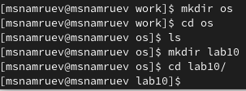

## Выполнение лабораторной работы

Вызываю vi и создаю файл hello.sh 

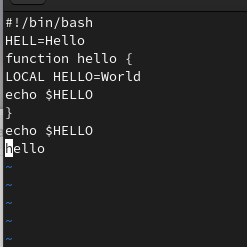

## Выполнение лабораторной работы

Нажимаю на клавишу i и ввожу следующий тескт.

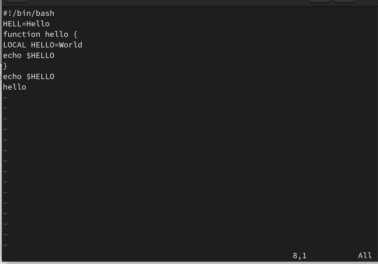

## Выполнение лабораторной работы

Нажмаю калвишу ESC для перехода в командный редим после завершения ввода теста. Записываю и выхожу.

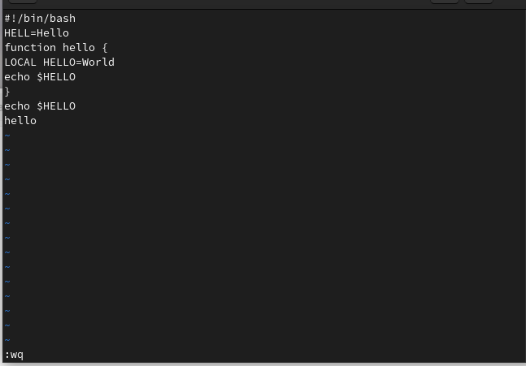

## Выполнение лабораторной работы

Делаю файл исполняемым

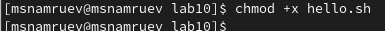

## Выполнение лабораторной работы

Вызываю редактирование текста, перехожу в режим вставки и заменяю HELL на HELLO.

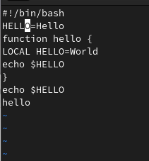

## Выполнение лабораторной работы

Ввожу вместо LOCAL local.

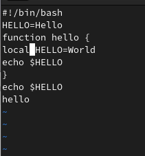

## Выполнение лабораторной работы

Вставляю в последнюю строку echo $HELLO.

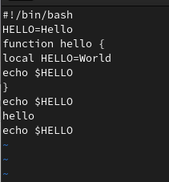

## Выполнение лабораторной работы

Удаляю последнюю строку.(

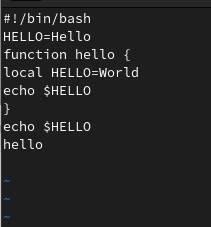

## Выполнение лабораторной работы

Отменяю последнее действие.

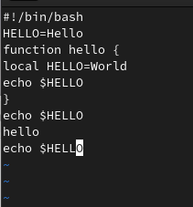

## Выполнение лабораторной работы

Записываю изменения и выхожу из vi.

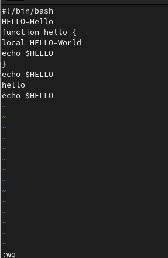

## Выводы

После выполнения данной лаьораторной работы я получил практические навыки работы с редактором vi.

