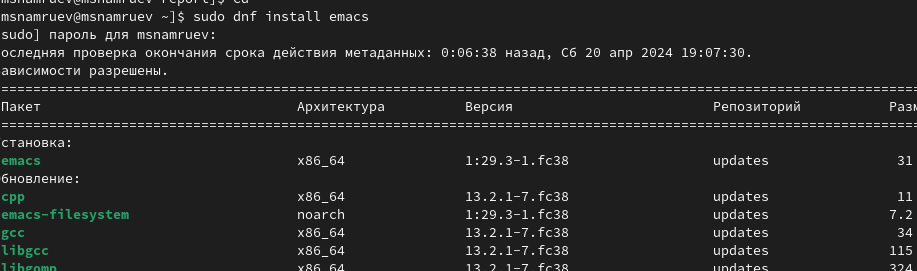
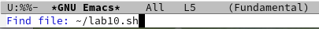
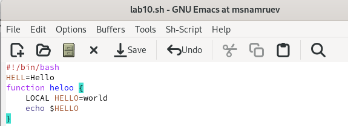
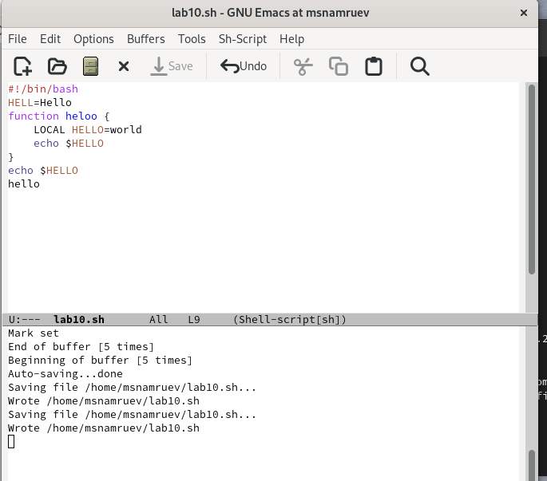
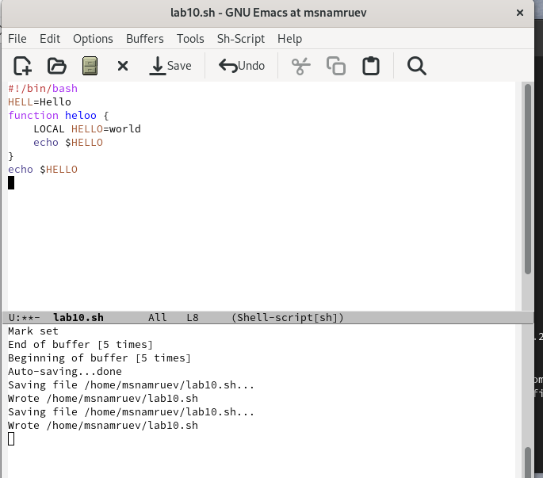
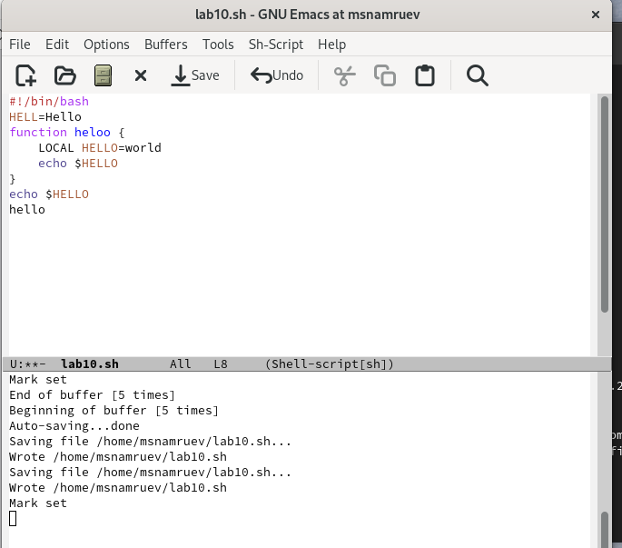
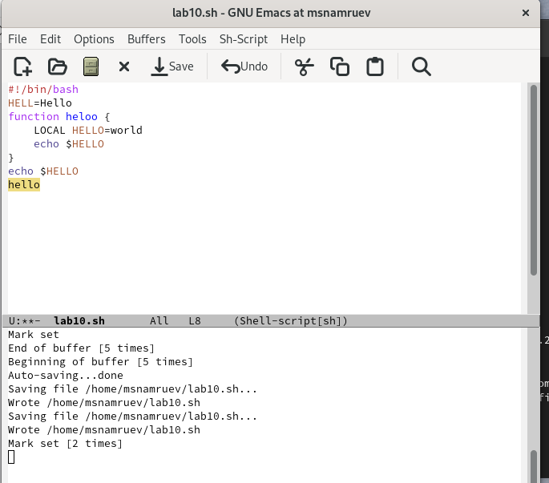
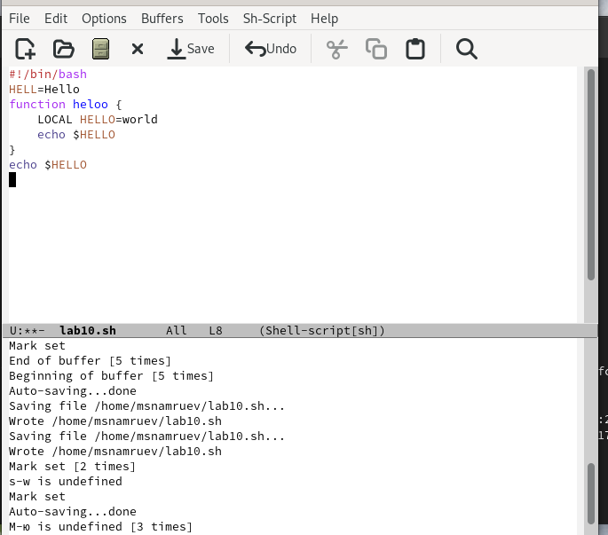
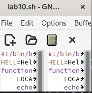

---
## Front matter
lang: ru-RU
title: Лабораторная работа №11
subtitle: Операционные системы
author:
  - Намруев М.С
institute:
  - Российский университет дружбы народов, Москва, Россия
date: 20 апреля 2024

## i18n babel
babel-lang: russian
babel-otherlangs: english

## Fonts
mainfont: PT Sans
romanfont: PT Sans
sansfont: PT Sans
monofont: PT Sans
mainfontoptions: Ligatures=TeX
romanfontoptions: Ligatures=TeX
sansfontoptions: Ligatures=TeX,Scale=MatchLowercase
monofontoptions: Scale=MatchLowercase,Scale=0.9

## Formatting pdf
toc: false
toc-title: Содержание
slide_level: 2
aspectratio: 169
section-titles: true
theme: metropolis
header-includes:
 - \metroset{progressbar=frametitle,sectionpage=progressbar,numbering=fraction}
 - '\makeatletter'
 - '\beamer@ignorenonframefalse'
 - '\makeatother'
---

## Докладчик

:::::::::::::: {.columns align=center}
::: {.column width="70%"}

  * Намруев Максим Саналович
  * студент
  * Российский университет дружбы народов
  * [1132236035@rudn.ru](mailto:1132236035@rudn.ru)
  * <https://msnamruev.github.io/ru/>

:::
::: {.column width="30%"}

:::
::::::::::::::

## Цель работы

Познакомиться с операционной системой Linux. Получить практические навыки работы с редактором Emacs.

## Задание

1. Ознакомиться с теоретическим материалом.

2. Ознакомиться с редактором emacs.

3. Выполнить упражнения.

4. Ответить на контрольные вопросы

## Выполнение лабораторной работы

Скачиваю emacs 

## Выполнение лабораторной работы

Открываю его и создаю файл lab10.sh.

## Выполнение лабораторной работы

Набираю текст.

## Выполнение лабораторной работы

Сохраняю его.

## Выполнение лабораторной работы

Вырезаю командой одну строчку.

## Выполнение лабораторной работы

Вставляю эту строчку в конец файла.

## Выполнение лабораторной работы

Выделяю строчку.

## Выполнение лабораторной работы

Копирую строчку в буфер обмена.

## Выполнение лабораторной работы

ватафак.

## Выполнение лабораторной работы

tf you want from me?

## Выводы

whatever

