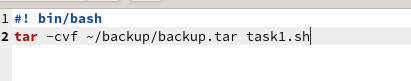
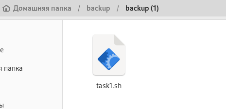
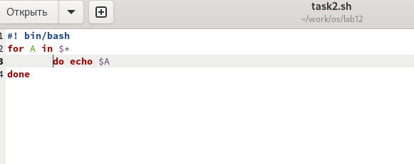
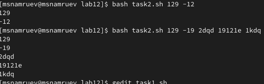
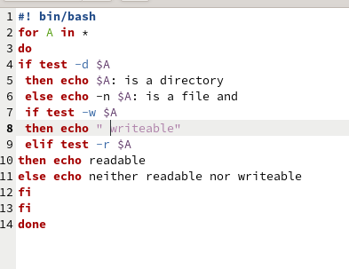
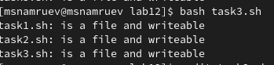
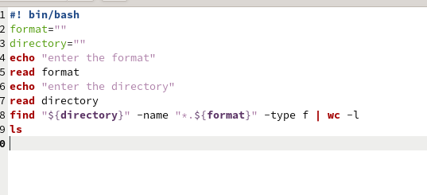
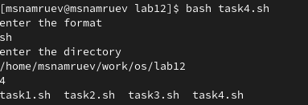

---
## Front matter
lang: ru-RU
title: Лаборатонрая работа №12
subtitle: Операционные системы
author:
  - Намруев М.С.
institute:
  - Российский университет дружбы народов, Москва, Россия
date: 27 апреля 2024

## i18n babel
babel-lang: russian
babel-otherlangs: english

## Fonts
mainfont: PT Sans
romanfont: PT Sans
sansfont: PT Sans
monofont: PT Sans
mainfontoptions: Ligatures=TeX
romanfontoptions: Ligatures=TeX
sansfontoptions: Ligatures=TeX,Scale=MatchLowercase
monofontoptions: Scale=MatchLowercase,Scale=0.9

## Formatting pdf
toc: false
toc-title: Содержание
slide_level: 2
aspectratio: 169
section-titles: true
theme: metropolis
header-includes:
 - \metroset{progressbar=frametitle,sectionpage=progressbar,numbering=fraction}
 - '\makeatletter'
 - '\beamer@ignorenonframefalse'
 - '\makeatother'
---

## Докладчик

:::::::::::::: {.columns align=center}
::: {.column width="70%"}

  * Намруев Максим Саналович
  * студент
  * Российский университет дружбы народов
  * [1132236035@rudn.ru](mailto:1132236035@rudn.ru)
  * <https://msnamruev.github.io/ru/>

:::
::: {.column width="30%"}

:::
::::::::::::::

## Цель работы

Изучить основы программирования в оболочке ОС UNIX/Linux. Научиться писать небольшие командные файлы

## Задание

1. Написать скрипт, который при запуске будет делать резервную копию самого себя (то есть файла, в котором содержится его исходный код) в другую директорию backup в вашем домашнем каталоге. При этом файл должен архивироваться одним из ар-
хиваторов на выбор zip, bzip2 или tar. Способ использования команд архивации необходимо узнать, изучив справку.

## Задание

2. Написать пример командного файла, обрабатывающего любое произвольное число аргументов командной строки, в том числе превышающее десять. Например, скрипт может последовательно распечатывать значения всех переданных аргументов.

## Задание

3. Написать командный файл — аналог команды ls (без использования самой этой команды и команды dir). Требуется, чтобы он выдавал информацию о нужном каталоге и выводил информацию о возможностях доступа к файлам этого каталога.

## Задание

4. Написать командный файл, который получает в качестве аргумента командной строки формат файла (.txt, .doc, .jpg, .pdf и т.д.) и вычисляет количество таких файлов в указанной директории. Путь к директории также передаётся в виде аргумента командной строки

## Выполнение лабораторной работы

Создаю файл task1.sh на пишу программу 

## Выполнение лабораторной работы

Проверяю работу программы.

## Выполнение лабораторной работы

Создаю файл task2.sh на пишу программу 

## Выполнение лабораторной работы

Проверяю работу программы.

## Выполнение лабораторной работы

Создаю файл task3.sh на пишу программу 

## Выполнение лабораторной работы

Проверяю работу программы.

## Выполнение лабораторной работы

Создаю файл task4.sh на пишу программу 

## Выполнение лабораторной работы

Проверяю работу программы.

## Выводы

После выполнения данной лабораторой работы я научился писать простейшие программы на ОС LINUX
