---
## Front matter
lang: ru-RU
title: Индивидумальный проект Этап 1
subtitle: Операционные системы
author:
  - Намруев М. С.
institute:
  - Российский университет дружбы народов, Москва, Россия
date: 02 марта 2024

## i18n babel
babel-lang: russian
babel-otherlangs: english

## Fonts
mainfont: PT Sans
romanfont: PT Sans
sansfont: PT Sans
monofont: PT Sans
mainfontoptions: Ligatures=TeX
romanfontoptions: Ligatures=TeX
sansfontoptions: Ligatures=TeX,Scale=MatchLowercase
monofontoptions: Scale=MatchLowercase,Scale=0.9

## Formatting pdf
toc: false
toc-title: Содержание
slide_level: 2
aspectratio: 169
section-titles: true
theme: metropolis
header-includes:
 - \metroset{progressbar=frametitle,sectionpage=progressbar,numbering=fraction}
 - '\makeatletter'
 - '\beamer@ignorenonframefalse'
 - '\makeatother'
---

## Докладчик

:::::::::::::: {.columns align=center}
::: {.column width="70%"}

  * Намруев Максим Саналович
  * Студунт, 1 курс, НКАбд-04-23
  * Российский университет дружбы народов
  * [1132236035@rudn.ru](mailto:1132236035@rudn.ru)
  * <https://github.com/msnamruev>

:::
::: {.column width="30%"}

:::
::::::::::::::

## Цель работы

Размещение на Github pages заготовки для персонального сайта.

## Выполнение лабораторной работы

Скачиваю архив приложения hugo 

## Выполнение лабораторной работы

Разархивирую архив.

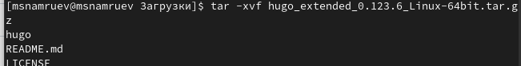

## Выполнение лабораторной работы

Переношу приложение hugo в /usr/local/bin.

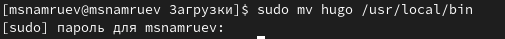

## Выполнение лабораторной работы

Создаю новый репозиторий по шаблону (blog).

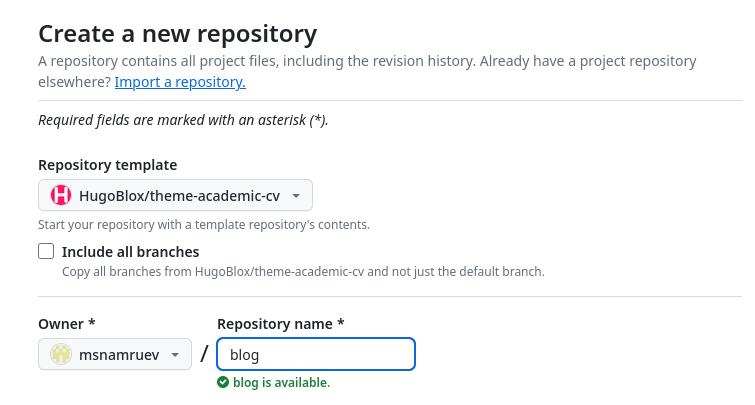

## Выполнение лабораторной работы

Клонирую репозитоий в blog.

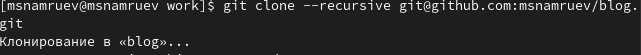

## Выполнение лабораторной работы

Скачиваю разширение go.

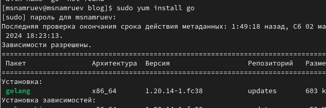

## Выполнение лабораторной работы

Прописываю команду hugo server, создавая сайт локально.

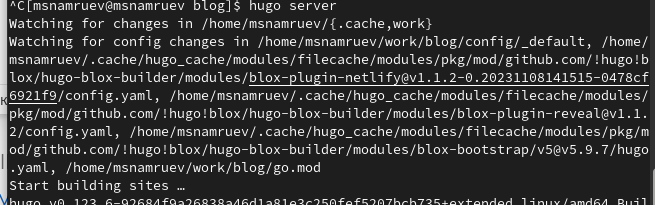

## Выполнение лабораторной работы

Перехожу по ссылке и проверяю создание сайта.

## Выполнение лабораторной работы

Создаю ещё один репозиторий без шаблона (msnamruev.github.io).

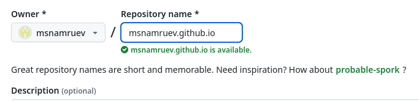

## Выполнение лабораторной работы

Клонирую его.

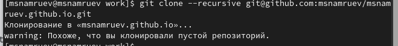

## Выполнение лабораторной работы

Перехожу в него и переключаюсь на новую ветку "main".

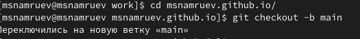

## Выполнение лабораторной работы

Создаю файл README.md и отправляю данные на github.

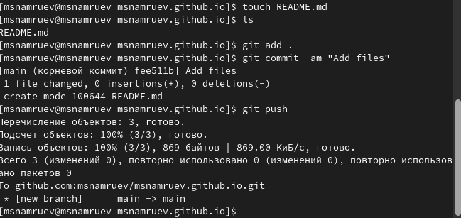

## Выполнение лабораторной работы

Далее с помощью mc перехожу в gitignore и комментирую public.

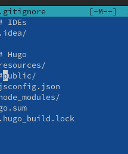

## Выполнение лабораторной работы

Далее удаляю папку public и клонирую репозиторий в новую папку public.

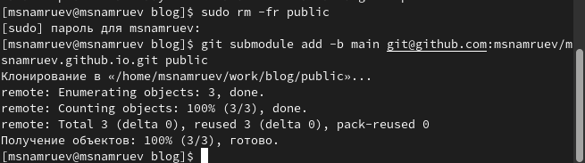

## Выполнение лабораторной работы

Запускаю приложение hugo.

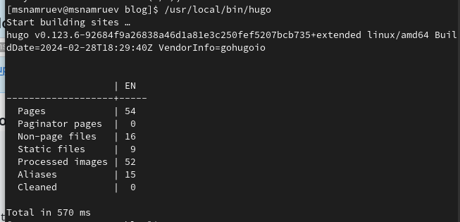

## Выполнение лабораторной работы

Перехожу в папку public и проверяю корректность выполнения работы запуска приложения.

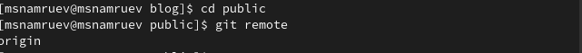

## Выполнение лабораторной работы

Отправляю данные по github.

## Выполнение лабораторной работы

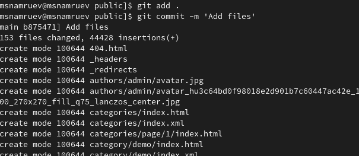

## Выполнение лабораторной работы

И наконец проверяю работу сайта.

## Выводы

После выполнения данного этапа я разместил на github pages заготовки для персонального сайта

