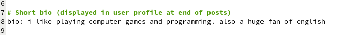

---
## Front matter
lang: ru-RU
title: Индивидуальный проект Этап 2
subtitle: Операционные системы
author:
  - Намруев М. С.
institute:
  - Российский университет дружбы народов, Москва, Россия
date: 16 марта 2024

## i18n babel
babel-lang: russian
babel-otherlangs: english

## Fonts
mainfont: PT Sans
romanfont: PT Sans
sansfont: PT Sans
monofont: PT Sans
mainfontoptions: Ligatures=TeX
romanfontoptions: Ligatures=TeX
sansfontoptions: Ligatures=TeX,Scale=MatchLowercase
monofontoptions: Scale=MatchLowercase,Scale=0.9

## Formatting pdf
toc: false
toc-title: Содержание
slide_level: 2
aspectratio: 169
section-titles: true
theme: metropolis
header-includes:
 - \metroset{progressbar=frametitle,sectionpage=progressbar,numbering=fraction}
 - '\makeatletter'
 - '\beamer@ignorenonframefalse'
 - '\makeatother'
---

## Докладчик

:::::::::::::: {.columns align=center}
::: {.column width="70%"}

  * Намруев Максим Саналович
  * студент, 1 курс, НКАбд-04-23
  * Российский университет дружбы народов
  * [1132236035@rudn.ru](mailto:1132236035@rudn.ru)
  * <https://msnamruev.github.io/ru/>

:::
::: {.column width="30%"}

:::
::::::::::::::

## Цель работы

Добавить к сайту данные о себе.

## Задание

1. Разместить фотографию владельца сайта.

2. Разместить краткое описание владельца сайта (Biography).

3. Добавить информацию об интересах (Interests).

4. Добавить информацию от образовании (Education).

5. Сделать пост по прошедшей неделе.

6. Управление версиями. Git.

## Выполнение лабораторной работы

Размещаю свою фотографию в папке admin 

## Выполнение лабораторной работы

Ввожу своё имя.

## Выполнение лабораторной работы

Размещаю краткое описание себя.

## Выполнение лабораторной работы

Заполняю информацию об интересах.

## Выполнение лабораторной работы

Добавляю информацию об образовании.

## Выполнение лабораторной работы

Проверяю сайт на локальном хосте.

## Выполнение лабораторной работы

Добавляю пост о том как прошла моя неделя.

## Выполнение лабораторной работы

Добавляю пост об управлении версиями git. 

## Выполнение лабораторной работы

Отправляю данный на гитхаб и проверяю работу сайта.

## Выводы

После выполянения данного этапа я добавил к сайту данные о себе.

