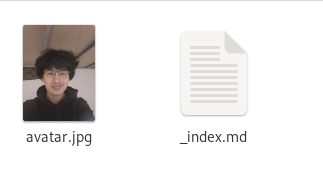
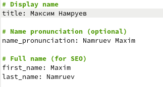
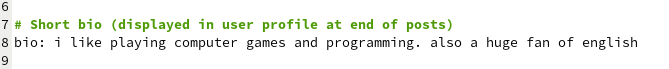
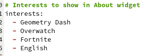
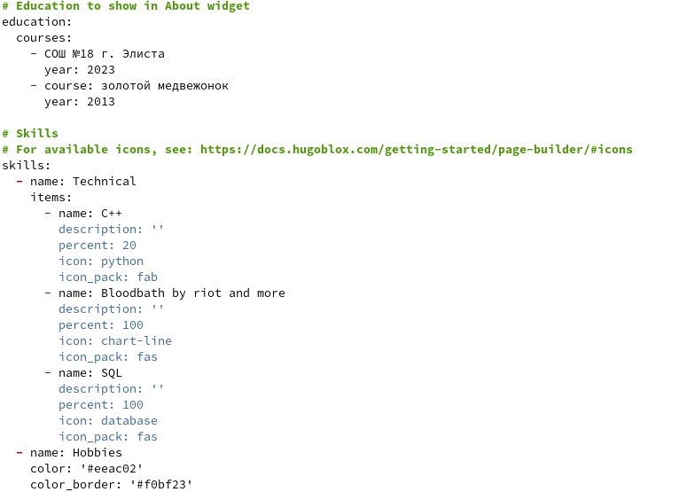
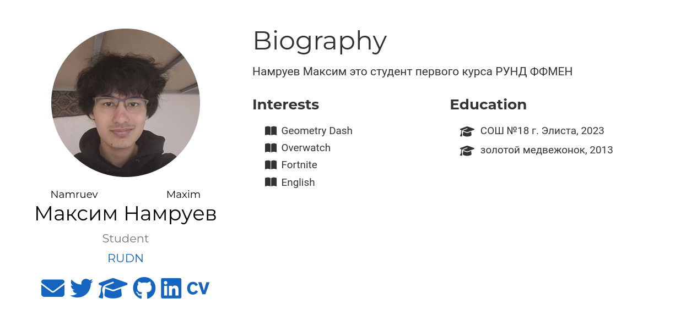
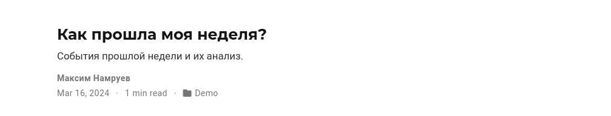
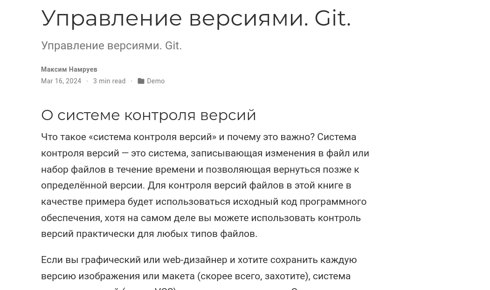
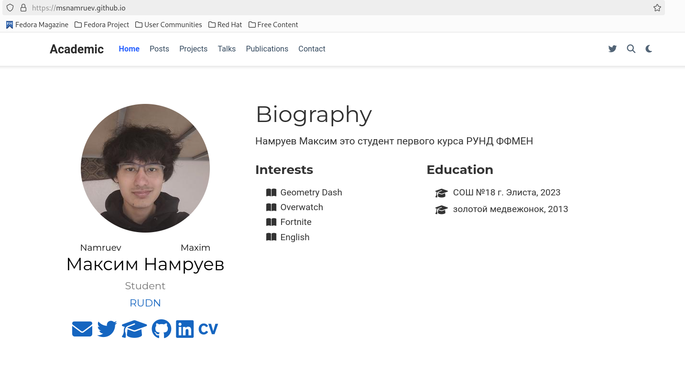

---
## Front matter
title: "Индивидуальный проект этпа 2"
subtitle: "Операционные системы"
author: "Намруев Максим Санлович"

## Generic otions
lang: ru-RU
toc-title: "Содержание"

## Bibliography
bibliography: bib/cite.bib
csl: pandoc/csl/gost-r-7-0-5-2008-numeric.csl

## Pdf output format
toc: true # Table of contents
toc-depth: 2
lof: true # List of figures
lot: true # List of tables
fontsize: 12pt
linestretch: 1.5
papersize: a4
documentclass: scrreprt
## I18n polyglossia
polyglossia-lang:
  name: russian
  options:
	- spelling=modern
	- babelshorthands=true
polyglossia-otherlangs:
  name: english
## I18n babel
babel-lang: russian
babel-otherlangs: english
## Fonts
mainfont: PT Sans
romanfont: PT Sans
sansfont: PT Sans
monofont: PT Sans
mainfontoptions: Ligatures=TeX
romanfontoptions: Ligatures=TeX
sansfontoptions: Ligatures=TeX,Scale=MatchLowercase
monofontoptions: Scale=MatchLowercase,Scale=0.9
## Biblatex
biblatex: true
biblio-style: "gost-numeric"
biblatexoptions:
  - parentracker=true
  - backend=biber
  - hyperref=auto
  - language=auto
  - autolang=other*
  - citestyle=gost-numeric
## Pandoc-crossref LaTeX customization
figureTitle: "Рис."
tableTitle: "Таблица"
listingTitle: "Листинг"
lofTitle: "Список иллюстраций"
lotTitle: "Список таблиц"
lolTitle: "Листинги"
## Misc options
indent: true
header-includes:
  - \usepackage{indentfirst}
  - \usepackage{float} # keep figures where there are in the text
  - \floatplacement{figure}{H} # keep figures where there are in the text
---

# Цель работы

Добавить к сайту данные о себе.

# Задание

1. Разместить фотографию владельца сайта.

2. Разместить краткое описание владельца сайта (Biography).

3. Добавить информацию об интересах (Interests).

4. Добавить информацию от образовании (Education).

5. Сделать пост по прошедшей неделе.

6. Управление версиями. Git.

# Выполнение лабораторной работы

Размещаю свою фотографию в папке admin (рис. [-@fig:001]).

{#fig:001 width=70%}

Ввожу своё имя.(рис. [-@fig:002]).

{#fig:002 width=70%}

Размещаю краткое описание себя.(рис. [-@fig:003]).

{#fig:003 width=70%}

Заполняю информацию об интересах.(рис. [-@fig:004]).

{#fig:004 width=70%}

Добавляю информацию об образовании.(рис. [-@fig:005]).

{#fig:005 width=70%}

Проверяю сайт на локальном хосте.(рис. [-@fig:006]).

{#fig:006 width=70%}

Добавляю пост о том как прошла моя неделя.(рис. [-@fig:007]).

{#fig:007 width=70%}

Добавляю пост об управлении версиями git. (рис. [-@fig:008]).

{#fig:008 width=70%}

Отправляю данный на гитхаб и проверяю работу сайта.(рис. [-@fig:009]).

{#fig:009 width=70%}

# Выводы

После выполянения данного этапа я добавил к сайту данные о себе.

