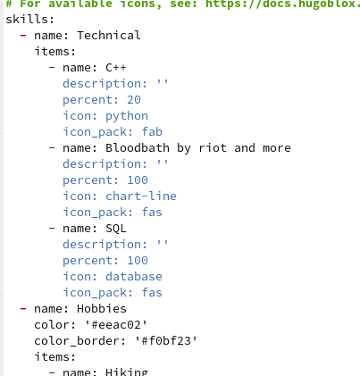
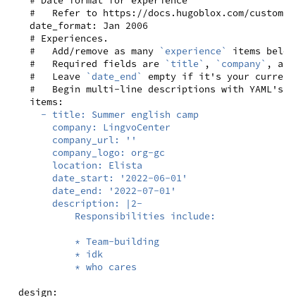
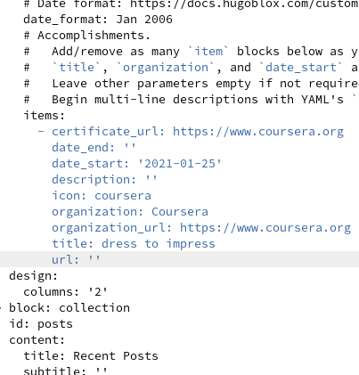
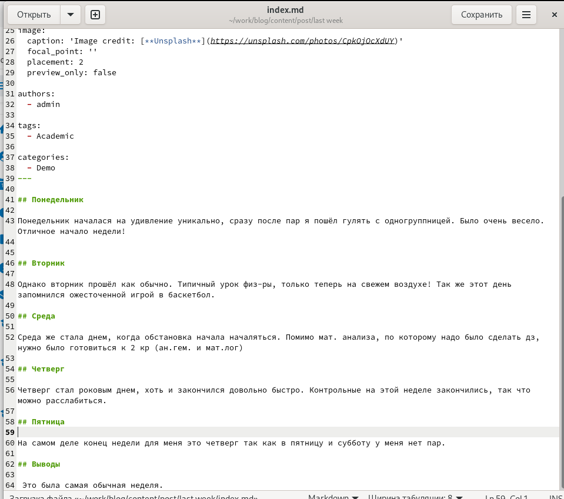
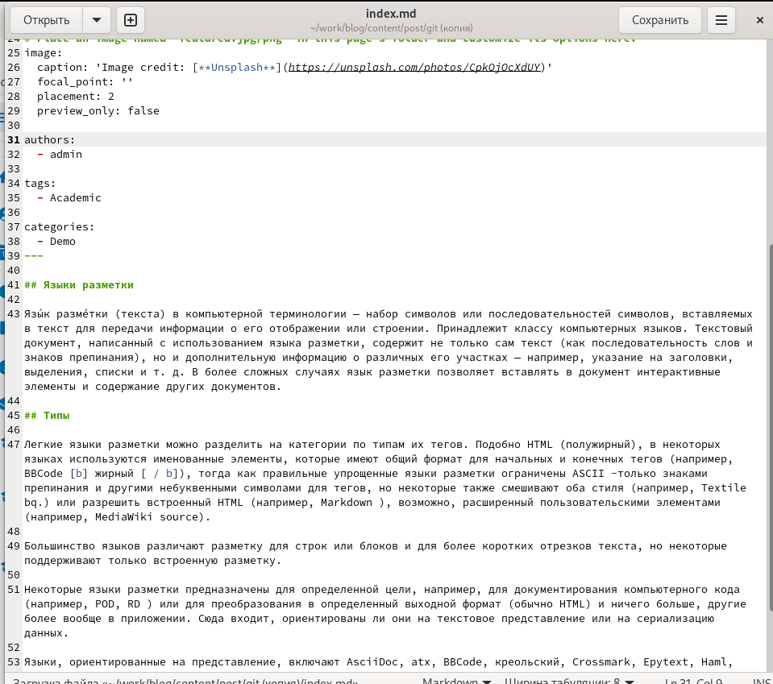

---
## Front matter
lang: ru-RU
title: Индивидуальный проект этап 3
subtitle: Операционные системы
author:
  - Намруев М. С
institute:
  - Российский университет дружбы народов, Москва, Россия
date: 06 апреля 2024

## i18n babel
babel-lang: russian
babel-otherlangs: english
## Fonts
mainfont: PT Sans
romanfont: PT Sans
sansfont: PT Sans
monofont: PT Sans
mainfontoptions: Ligatures=TeX
romanfontoptions: Ligatures=TeX
sansfontoptions: Ligatures=TeX,Scale=MatchLowercase
monofontoptions: Scale=MatchLowercase,Scale=0.9

## Formatting pdf
toc: false
toc-title: Содержание
slide_level: 2
aspectratio: 169
section-titles: true
theme: metropolis
header-includes:
 - \metroset{progressbar=frametitle,sectionpage=progressbar,numbering=fraction}
 - '\makeatletter'
 - '\beamer@ignorenonframefalse'
 - '\makeatother'
---

## Докладчик

:::::::::::::: {.columns align=center}
::: {.column width="70%"}

  * Намруев Максим Саналович
  * студент, 1 курс, НКАбд-04-23
  * Российский университет дружбы народов
  * [1132236035@rudn.ru](mailto:1132236035@rudn.ru)
  * <https://msnamruev.github.io/ru/>

:::
::: {.column width="30%"}

:::
::::::::::::::

## Цель работы

Добавить к сайту достижения

## Задание

    Список достижений.
    
        Добавить информацию о навыках (Skills).
        
        Добавить информацию об опыте (Experience).
        
        Добавить информацию о достижениях (Accomplishments).
        
    Сделать пост по прошедшей неделе.
    
    Добавить пост на тему по выбору:
    
Легковесные языки разметки.
        
Языки разметки. LaTeX.
        
Язык разметки Markdown.
      

## Выполнение лабораторной работы

Открываю файл index.md заполяю информацию о навыках 

## Выполнение лабораторной работы

Дальше заполяю информацию о моем опыте работы

## Выполнение лабораторной работы

Далее информацию о достижениях

## Выполнение лабораторной работы

Делаю пост о прошедшей недели.

## Выполнение лабораторной работы

И пост о легковесных языках разметки

## Выводы

Я добавил к сайту достижения

